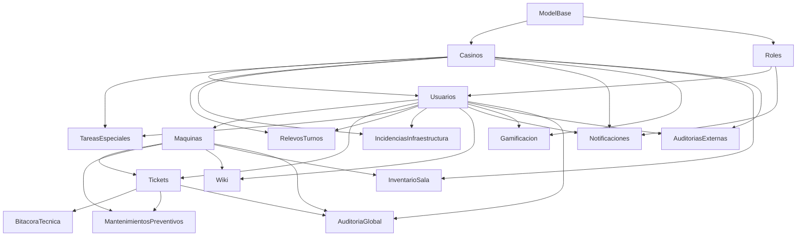

# Manual del Programador — NEXUS Backend

**Framework:** Django 4.x + Django REST Framework  
**Base de datos:** MySQL 8.x  
**Servidor:** `cytechn.ddns.net:8000`  
**Directorio raíz:** `BackEnd/`

---

## Arquitectura General

NEXUS es un sistema de gestión de mantenimiento de casinos con 22 aplicaciones Django. La arquitectura sigue el patrón:

```
Frontend Vue 3 (puerto 5173)
        │
        │  HTTP Bearer Token
        ▼
SessionTokenMiddleware  ──► autentica por UUID token en DB
        │
AuditMiddleware         ──► captura usuario en thread-local
        │
DRF ViewSet             ──► lógica de negocio
        │
Signal post_save        ──► gamificación, notificaciones, auditoría
        │
MySQL DB (ot)
```

---

## Sistema de Autenticación

No se usa JWT. El sistema implementa **tokens UUID** almacenados en `Usuarios.session_token`:

1. `POST /api/usuarios/login/` — genera UUID, lo guarda en DB, lo devuelve al cliente
2. El cliente guarda el token en `localStorage`
3. Cada request incluye el header: `Authorization: Bearer <uuid>`
4. `SessionTokenMiddleware` busca el token en DB y asigna `request.user`

---

## Acceso Rápido a la Documentación

### Configuración del Proyecto

| Documento | Descripción |
|---|---|
| [settings.md](configuracion/settings.md) | INSTALLED_APPS, DATABASES, CORS, REST_FRAMEWORK |
| [middleware.md](configuracion/middleware.md) | SessionTokenMiddleware + AuditMiddleware |
| [exceptions.md](configuracion/exceptions.md) | custom_exception_handler — formato de errores |

---

### Modelos

| Documento | Modelos |
|---|---|
| [ModeloBase.md](models/ModeloBase.md) | Clase abstracta con campos de auditoría comunes |
| [Casino.md](models/Casino.md) | Sucursales, grid Digital Twin |
| [Rol.md](models/Rol.md) | Catálogo de roles del sistema |
| [Usuarios.md](models/Usuarios.md) | AbstractBaseUser, UUID token, sistema RPG |
| [Maquina.md](models/Maquina.md) | Máquina de casino, validaciones, coordenadas |
| [Ticket.md](models/Ticket.md) | Tickets de soporte, folio automático |
| [LogAuditoria.md](models/LogAuditoria.md) | Log inmutable de cambios en modelos |
| [BitacoraTecnica.md](models/BitacoraTecnica.md) | Registro de intervenciones técnicas |
| [MantenimientoPreventivo.md](models/MantenimientoPreventivo.md) | Mantenimientos preventivos |
| [Notificacion.md](models/Notificacion.md) | Sistema de notificaciones con segmentación |
| [Gamificacion.md](models/Gamificacion.md) | Recompensas y canjes del sistema RPG |
| [AuditoriaServicioExterno.md](models/AuditoriaServicioExterno.md) | Control de acceso de proveedores |
| [IncidenciaInfraestructura.md](models/IncidenciaInfraestructura.md) | Eventos de infraestructura |
| [TareaEspecial.md](models/TareaEspecial.md) | Tareas ajenas a máquinas |
| [RelevoTurno.md](models/RelevoTurno.md) | Traspaso de turno entre técnicos |
| [WikiTecnica.md](models/WikiTecnica.md) | Guías técnicas con flujo de aprobación |
| [Denominacion.md](models/Denominacion.md) | Catálogo de denominaciones monetarias |
| [Proveedor.md](models/Proveedor.md) | Catálogo de proveedores |
| [ModelosMencionados.md](models/ModelosMencionados.md) | ModeloMaquina, EvolucionNexus, InventarioSala, MenuConfig |

---

### Serializers

| Documento | Serializers |
|---|---|
| [UsuariosSerializer.md](serializers/UsuariosSerializer.md) | UsuariosSerializer — auth, RPG delegation, avatar |
| [TicketSerializer.md](serializers/TicketSerializer.md) | TicketSerializer + TicketCentroServiciosSerializer |
| [MaquinaSerializer.md](serializers/MaquinaSerializer.md) | MaquinaSerializer + MaquinaMapaSerializer |
| [NotificacionGamificacionSerializer.md](serializers/NotificacionGamificacionSerializer.md) | Notificacion + segmentación + Gamificacion |
| [WikiSerializer.md](serializers/WikiSerializer.md) | WikiTecnicaPropuesta + Publica + Admin |
| [OperacionalesSerializer.md](serializers/OperacionalesSerializer.md) | BitacoraTécnica, MantenimientoPreventivo, RelevoTurno, TareaEspecial, Incidencia |
| [CatalogosSerializer.md](serializers/CatalogosSerializer.md) | Casino, Rol, AuditoriaServicioExterno, InventarioSala |

---

### Signals

| Documento | App | Descripción |
|---|---|---|
| [AuditoriaGlobalSignals.md](signals/AuditoriaGlobalSignals.md) | AuditoriaGlobal | ThreadLocal + pre/post_save → LogAuditoria |
| [GamificacionSignals.md](signals/GamificacionSignals.md) | Gamificacion | 6 handlers, otorgar_puntos(), F() atómico |
| [IncidenciasSignals.md](signals/IncidenciasSignals.md) | IncidenciasInfraestructura | hora_fin → notificaciones por severidad |

---

### Views (ViewSets)

| Documento | ViewSets | Endpoints clave |
|---|---|---|
| [UsuariosViewSet.md](views/UsuariosViewSet.md) | UsuariosViewSet | login, refresh_token, switch_estado, dashboard_stats |
| [MaquinaViewSet.md](views/MaquinaViewSet.md) | MaquinaViewSet | mapa-completo, actualizar-coordenadas, incrementar-fallas |
| [TicketViewSet.md](views/TicketViewSet.md) | TicketViewSet | lista_por_casino, historial_maquina, dashboard_charts |
| [NotificacionViewSet.md](views/NotificacionViewSet.md) | NotificacionViewSet, NotificacionUsuarioViewSet | count_no_leidas, marcar_leida |
| [GamificacionViewSets.md](views/GamificacionViewSets.md) | RecompensaGerenciaViewSet, RecompensaTecnicoViewSet | canjear, historial_canjes, mi_rango |
| [WikiViewSets.md](views/WikiViewSets.md) | WikiCentroMandoViewSet, WikiCentroServiciosViewSet | aprobar, publicar, rechazar, mis-propuestas |
| [BitacoraTecnicaViewSet.md](views/BitacoraTecnicaViewSet.md) | BitacoraTecnicaViewSet | filter ?ticket=, puntos_nexus en create |
| [MantenimientoRelevoTareaViewSets.md](views/MantenimientoRelevoTareaViewSets.md) | MantenimientoPreventivoViewSet, RelevoTurnoViewSet, TareaEspecialViewSet | Patrón común de gamificación |
| [IncidenciaInventarioViewSets.md](views/IncidenciaInventarioViewSets.md) | IncidenciaInfraestructuraViewSet, InventarioSalaViewSet | filter ?casino= |
| [LogAuditoriaViewSet.md](views/LogAuditoriaViewSet.md) | LogAuditoriaViewSet | tablas_afectadas, filtros dinámicos |

---

## Mapa de Dependencias entre Apps



---

## Rutas API

Todos los endpoints se registran bajo `/api/`. Tabla de rutas raíz:

| Prefijo | App | Descripción |
|---|---|---|
| `/api/roles/` | Roles | Catálogo de roles |
| `/api/casinos/` | Casinos | Gestión de casinos |
| `/api/usuarios/` | Usuarios | Auth + gestión de usuarios |
| `/api/proveedores/` | Proveedores | Catálogo de proveedores |
| `/api/modelos-maquinas/` | ModelosMaquinas | Catálogo de modelos |
| `/api/denominaciones/` | Denominaciones | Denominaciones monetarias |
| `/api/maquinas/` | Maquinas | Máquinas + Digital Twin |
| `/api/tickets/` | Tickets | Sistema de tickets |
| `/api/bitacora/` | BitacoraTecnica | Intervenciones técnicas |
| `/api/mantenimientos/` | MantenimientosPreventivos | Preventivos |
| `/api/tareas/` | TareasEspeciales | Tareas especiales |
| `/api/inventario/` | InventarioSala | Inventario de herramientas |
| `/api/incidencias/` | IncidenciasInfraestructura | Incidencias de infraestructura |
| `/api/relevos/` | RelevosTurnos | Relevos de turno |
| `/api/wiki/` | Wiki | Wiki técnica (2 ViewSets) |
| `/api/auditorias-externas/` | AuditoriasExternas | Acceso de proveedores |
| `/api/notificaciones/` | Notificaciones | Centro de notificaciones |
| `/api/evolucion/` | EvolucionNexus | Changelog del sistema |
| `/api/menus/` | Menus | Menús dinámicos por rol |
| `/api/auditoria/` | AuditoriaGlobal | Logs de auditoría |
| `/api/gamificacion/` | Gamificacion | Tienda de recompensas RPG |

---

## Sistema de Gamificación (RPG)

| Acción | Puntos |
|---|---|
| Crear Ticket | 10 pts |
| Cerrar Ticket | 30 pts |
| Registrar Bitácora Técnica | 20 pts |
| Registrar Preventivo | 25 pts |
| Documentar Relevo de Turno | 15 pts |
| Completar Tarea Especial | 35 pts |
| Publicar en Wiki (variable) | Definido por Administrador |

**Tabla de rangos RPG:**

| Nivel | Nombre | Puntos mínimos |
|---|---|---|
| 1 | Aprendiz | 0 |
| 2 | Técnico I | 100 |
| 3 | Técnico II | 300 |
| 4 | Técnico III | 600 |
| 5 | Técnico Experto | 1000 |
| 6 | Técnico Senior | 1500 |
| 7 | Especialista | 2100 |
| 8 | Maestro Técnico | 2800 |
| 9 | Leyenda | 3600 |
| 10 | NEXUS Elite | 4500 |

---

## Convenciones del Código

- **`creado_por` / `modificado_por`:** Campos de texto (no FK) con el `username`. Se asignan en `perform_create`/`perform_update` de los ViewSets.
- **`esta_activo`:** Soft delete. Los registros inactivos son excluidos del `get_queryset` por defecto.
- **`update_fields`:** Se usa explícitamente cuando solo se actualizan campos de control (coordenadas, estado) para omitir `full_clean()` y reducir el impacto de los signals.
- **`F()` expressions:** Usadas en todos los incrementos numéricos atómicos (fallas, puntos de gamificación).
- **`select_related`:** Declarado en todos los ViewSets que accedan a FKs para prevenir N+1.
- **Thread-local context:** El patrón `limpiar_puntos_context()` / `get_puntos_context()` transporta datos de gamificación desde signals hasta la respuesta HTTP.
