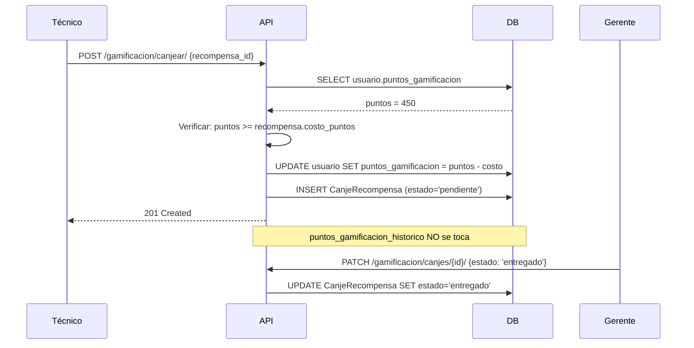

# RecompensaGamificacion / CanjeRecompensa — Tienda RPG

**Archivo fuente:** `BackEnd/Gamificacion/models.py`  
**Hereda de:** `ModeloBase`  
**Tablas BD:** `recompensa_gamificacion`, `canje_recompensa`  
**Propósito:** Tienda de recompensas del sistema RPG de NEXUS. Los técnicos acumulan puntos y los canjean por recompensas físicas o beneficios (días libres, bonos de alimentación, etc.) gestionadas por GERENCIA.

---

## Modelo: `RecompensaGamificacion`

### Campos

| Campo | Tipo Django | Nulo | Default | Descripción |
|---|---|---|---|---|
| `titulo` | `CharField(150)` | No | — | Nombre de la recompensa |
| `descripcion` | `TextField` | No | — | Detalle completo: qué incluye, cómo se reclama, vigencia |
| `costo_puntos` | `PositiveIntegerField` | No | — | Puntos necesarios para canjear |
| `casino` | `ForeignKey(Casino)` | No | — | Solo técnicos de este casino pueden ver la recompensa |
| `activo` | `BooleanField` | No | `True` | Ocultar sin eliminar. `False` = retirada del catálogo |
| `stock` | `PositiveIntegerField` | Sí | `None` | Cantidad máxima de canjes. `None` = ilimitado |
| *+ campos heredados de ModeloBase* | | | | |

### class Meta
```python
db_table = 'recompensa_gamificacion'
ordering = ['costo_puntos']
```

---

## Modelo: `CanjeRecompensa`

Historial de cada canje realizado. Al canjear:
- Se descuenta de `usuario.puntos_gamificacion` (disponibles)
- `puntos_gamificacion_historico` **NO** se modifica (el rango no cambia)

### Campos

| Campo | Tipo Django | Nulo | Default | Descripción |
|---|---|---|---|---|
| `usuario` | `ForeignKey(Usuarios)` | No | — | Técnico que canjeó. `PROTECT` |
| `recompensa` | `ForeignKey(RecompensaGamificacion)` | No | — | Recompensa canjeada. `PROTECT` para historial |
| `puntos_descontados` | `PositiveIntegerField` | No | — | Snapshot del costo al momento del canje |
| `estado` | `CharField(20)` | No | `'pendiente'` | Estado de entrega (choices) |
| `nota_gerencia` | `TextField` | Sí | `None` | Observaciones del gerente al procesar |
| *+ campos heredados de ModeloBase* | | | | |

### `ESTADO_CANJE_CHOICES`
| Valor | Etiqueta |
|---|---|
| `pendiente` | Pendiente de Entrega |
| `entregado` | Entregado |
| `cancelado` | Cancelado |

### class Meta
```python
db_table = 'canje_recompensa'
ordering = ['-creado_en']
```

---

## Flujo de Canje



---

## Por qué se guarda `puntos_descontados`

El campo `puntos_descontados` es un **snapshot** del costo al momento del canje. Si la recompensa cambia de precio más tarde (el gerente edita `costo_puntos`), el historial sigue siendo fiel al valor real que se descontó.
