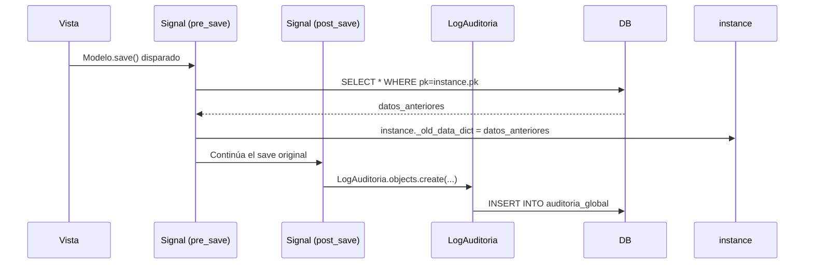

# LogAuditoria — Registro de Auditoría Global

**Archivo fuente:** `BackEnd/AuditoriaGlobal/models.py`  
**Hereda de:** `models.Model` (directamente, **sin** `ModeloBase`)  
**Tabla BD:** `auditoria_global`  
**Propósito:** Registro inmutable de cada evento CREATE, UPDATE y DELETE sobre cualquier modelo del sistema. Alimentado automáticamente por las signals de `AuditoriaGlobal`.

---

## ¿Por qué no hereda de ModeloBase?

`LogAuditoria` es un **registro de auditoría inmutable**. No debe tener `esta_activo` (no se puede "desactivar" un log), ni `modificado_en` (no debe modificarse). Hereda directamente de `models.Model` para tener control total de sus campos.

---

## Campos

| Campo | Tipo Django | Nulo | Default | Descripción |
|---|---|---|---|---|
| `tabla` | `CharField(100)` | No | — | Nombre de la clase del modelo afectado (ej. `"Maquina"`) |
| `registro_id` | `CharField(50)` | No | — | PK del registro afectado como string |
| `accion` | `CharField(20)` | No | — | `CREATE`, `UPDATE` o `DELETE` |
| `datos_anteriores` | `JSONField` | Sí | `None` | Snapshot del registro ANTES del cambio. `None` en creaciones |
| `datos_nuevos` | `JSONField` | Sí | `None` | Snapshot del registro DESPUÉS del cambio. `None` en eliminaciones |
| `fecha` | `DateTimeField` | No | `timezone.now` | Timestamp del evento |
| `usuario` | `ForeignKey(Usuarios)` | Sí | `None` | Quién realizó la acción. `SET_NULL` si el usuario es eliminado |
| `casino` | `ForeignKey(Casino)` | Sí | `None` | Casino del usuario que realizó la acción |

---

## Choices `ACCIONES`

| Valor | Etiqueta |
|---|---|
| `CREATE` | Crear |
| `UPDATE` | Actualizar |
| `DELETE` | Eliminar |

---

## `__str__`

```python
def __str__(self):
    usr = self.usuario.username if self.usuario else "Sistema"
    return f"[{self.fecha.strftime('%Y-%m-%d %H:%M:%S')}] {usr} {self.accion} en {self.tabla} (ID: {self.registro_id})"
```

Ejemplo: `[2026-02-24 14:30:00] rgarcia UPDATE en Maquina (ID: 42)`

---

## Ciclo de vida de un Log



---

## Modelos Excluidos

La signal ignora los siguientes modelos para evitar recursividad y ruido:

```python
IGNORE_MODELS = [
    'LogAuditoria', 'Session', 'LogEntry', 'ContentType', 'Permission', 'Group'
]
```

---

## class Meta

```python
class Meta:
    db_table = 'auditoria_global'
    verbose_name = "Log de Auditoría"
    verbose_name_plural = "Logs de Auditoría"
    ordering = ['-fecha']
```
