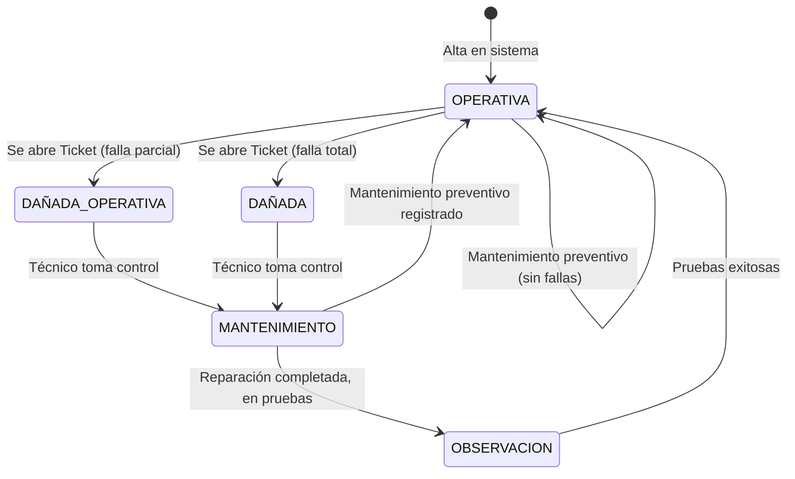

# Maquina — Modelo de Máquina de Casino

**Archivo fuente:** `BackEnd/Maquinas/models.py`  
**Hereda de:** `ModeloBase`  
**Tabla BD:** `maquinas`  
**Propósito:** Entidad central del inventario técnico. Representa cada unidad física en sala con su estado operativo, ubicación en el mapa, red y datos de licencia. Es el origen de tickets, mantenimientos, bitácoras y mantenimientos preventivos.

---

## Campos

| Campo | Tipo Django | Nulo | Default | Descripción |
|---|---|---|---|---|
| `modelo` | `ForeignKey(ModeloMaquina)` | No | — | Ficha técnica del modelo. `PROTECT` evita borrar el catálogo si hay máquinas |
| `casino` | `ForeignKey(Casino)` | No | — | Sede donde se encuentra físicamente. `CASCADE` borra las máquinas si se borra el casino |
| `denominaciones` | `ManyToManyField(Denominacion)` | — | — | Valores monetarios aceptados. Relación N:N |
| `uid_sala` | `CharField(20)` | No | — | Código de identificación en sala (ej. `A01`, `B-12`) |
| `numero_serie` | `CharField(100)` | No | — | Número de serie del fabricante |
| `ip_maquina` | `GenericIPAddressField` | No | — | IP asignada en la red del casino |
| `juego` | `CharField(150)` | No | — | Nombre del juego o `MULTIJUEGO` |
| `ubicacion_piso` | `CharField(50)` | No | `'PISO_1'` | Piso físico (choices: `PISO_1`…`SOTANO`, `OTRO`) |
| `ubicacion_sala` | `CharField(100)` | No | `'SALA_PRINCIPAL'` | Área interna (choices: `SALA_A`…`BAR`, `OTRO`) |
| `coordenada_x` | `PositiveIntegerField` | No | `0` | Columna en el mapa digital de sala |
| `coordenada_y` | `PositiveIntegerField` | No | `0` | Fila en el mapa digital de sala |
| `estado_actual` | `CharField(30)` | No | `'OPERATIVA'` | Estado técnico actual (ver choices) |
| `contador_fallas` | `PositiveIntegerField` | No | `0` | Acumulado de fallas registradas |
| `ultimo_mantenimiento` | `DateField` | Sí | `None` | Actualizado automáticamente por signal de `MantenimientoPreventivo` |
| `fecha_vencimiento_licencia` | `DateField` | Sí | `None` | Alerta de licencia vencida |
| *+ campos heredados de ModeloBase* | | | | |

---

## Choices

### `ESTADOS_CHOICES`
| Valor | Etiqueta |
|---|---|
| `OPERATIVA` | Operativa y Sin Fallas |
| `DAÑADA_OPERATIVA` | Dañada pero Operativa (Con Fallas) |
| `DAÑADA` | Dañada y No Operativa |
| `MANTENIMIENTO` | En Mantenimiento o Reparación |
| `OBSERVACION` | En Observación o Pruebas |
| `PRUEBAS` | Realizando Pruebas (No Disponible) |

### `PISO_CHOICES`
`PISO_1`, `PISO_2`, `PISO_3`, `PISO_4`, `PLANTA_BAJA`, `VIP`, `TERRAZA`, `SOTANO`, `OTRO`

### `SALA_CHOICES`
`SALA_A`…`SALA_D`, `SALA_PRINCIPAL`, `ZONA_FUMADORES`, `ZONA_NO_FUMADORES`, `ZONA_ALTA_DENOMINACION`, `BAR`, `ENTRADA`, `OTRO`

---

## `clean()` — Validaciones Cruzadas

El método `clean()` se ejecuta antes de cualquier `save()` (salvo cuando se especifican `update_fields`).

```python
def clean(self):
    # 1. Unicidad de IP por casino
    if self.ip_maquina:
        exists_ip = Maquina.objects.filter(casino=self.casino, ip_maquina=self.ip_maquina).exclude(id=self.id).exists()
        if exists_ip: raise ValidationError(...)

    # 2. Unicidad de número de serie por casino
    exists_serie = Maquina.objects.filter(casino=self.casino, numero_serie=self.numero_serie).exclude(id=self.id).exists()
    if exists_serie: raise ValidationError(...)

    # 3. Último mantenimiento no puede ser fecha futura
    if self.ultimo_mantenimiento and self.ultimo_mantenimiento > date.today():
        raise ValidationError(...)

    # 4. Licencia no puede estar vencida al crear
    if self.fecha_vencimiento_licencia and self.fecha_vencimiento_licencia < date.today():
        raise ValidationError(...)

    # 5. Coordenadas dentro del grid del Casino
    if self.coordenada_x > self.casino.grid_width or self.coordenada_y > self.casino.grid_height:
        raise ValidationError(...)

    # 6. Dos máquinas no pueden ocupar la misma celda en la misma sala/piso del casino
    exists_coordenada = Maquina.objects.filter(
        casino=self.casino, ubicacion_sala=self.ubicacion_sala,
        ubicacion_piso=self.ubicacion_piso,
        coordenada_x=self.coordenada_x, coordenada_y=self.coordenada_y
    ).exclude(id=self.id).exists()
    if exists_coordenada: raise ValidationError(...)
```

---

## `save()` — Llamada a `full_clean()`

```python
def save(self, *args, **kwargs):
    update_fields = kwargs.get('update_fields')
    if not update_fields:
        self.full_clean()
    super().save(*args, **kwargs)
```

**Por qué:** Cuando se llama `save()` sin `update_fields`, se ejecutan todas las validaciones. Al usar `update_fields` (ej. desde el signal de `MantenimientoPreventivo`), se salta el `full_clean()` para evitar re-validar campos que no cambiaron, lo que además previene errores de validación de fecha de licencia en actualizaciones parciales.

---

## class Meta

```python
class Meta:
    db_table = 'maquinas'
    unique_together = ('casino', 'uid_sala')
```

La restricción `unique_together` garantiza que el código de sala (`uid_sala`) sea único dentro de cada casino. No es una restricción global, por lo que `A01` puede existir en dos casinos distintos.

---

## Flujo completo de una Máquina


