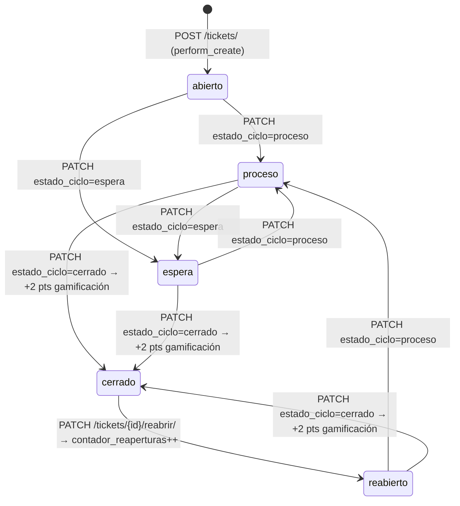

# Ticket — Modelo de Incidencia Técnica

**Archivo fuente:** `BackEnd/Tickets/models.py`  
**Hereda de:** `ModeloBase`  
**Tabla BD:** `tickets`  
**Propósito:** Representa una incidencia reportada sobre una máquina. Es la entidad central del flujo de mantenimiento correctivo. Cada ticket tiene un folio único autogenerado, ciclo de vida de estados y se relaciona con bitácoras técnicas.

---

## Campos

| Campo | Tipo Django | Nulo | Default | Descripción |
|---|---|---|---|---|
| `maquina` | `ForeignKey(Maquina)` | No | — | Máquina afectada. `CASCADE` elimina tickets si se borra la máquina |
| `reportante` | `ForeignKey(Usuarios)` | No | — | Usuario que reporta el problema. `PROTECT` |
| `tecnico_asignado` | `ForeignKey(Usuarios)` | Sí | `None` | Técnico responsable. `SET_NULL` cuando el técnico es dado de baja |
| `folio` | `CharField(20)` | No | auto | Código único. Formato: `TK-{AÑO}-{NNNN}`. `editable=False` |
| `categoria` | `CharField(30)` | No | — | Tipo de falla (choices) |
| `subcategoria` | `CharField(50)` | Sí | `None` | Detalle específico (ej. "Billetero trabado") |
| `prioridad` | `CharField(20)` | No | `'media'` | Urgencia del ticket |
| `descripcion_problema` | `TextField` | No | — | Detalle del problema reportado |
| `estado_maquina_reportado` | `CharField(30)` | Sí | `None` | Estado al que se actualizó la máquina al crear el ticket |
| `estado_ciclo` | `CharField(20)` | No | `'abierto'` | Estado del ticket en su ciclo de vida |
| `notas_seguimiento` | `TextField` | Sí | `None` | Notas libres del técnico |
| `explicacion_cierre` | `TextField` | Sí | `None` | Motivo de cierre |
| `contador_reaperturas` | `PositiveIntegerField` | No | `0` | Veces que se reabrió el ticket |
| *+ campos heredados de ModeloBase* | | | | |

---

## Choices

### `CATEGORIAS_CHOICES`
| Valor | Etiqueta |
|---|---|
| `hardware` | Hardware |
| `perifericos` | Periféricos |
| `software` | Software |
| `red` | Red / Comunicación |
| `otros` | Otros |

### `PRIORIDAD_CHOICES`
| Valor | Etiqueta |
|---|---|
| `baja` | Baja |
| `media` | Media |
| `alta` | Alta |
| `critica` | Crítica |
| `emergencia` | Emergencia |
| `sin_prioridad` | Sin Prioridad |

### `ESTADO_TICKET_CHOICES`
| Valor | Descripción |
|---|---|
| `abierto` | Recién creado, sin técnico asignado |
| `proceso` | Técnico trabajando activamente |
| `espera` | Esperando refacción o información |
| `cerrado` | Resuelto. Evento que dispara gamificación (+2 pts) |
| `reabierto` | Reabierto tras un cierre previo |

---

## `save()` — Generación de Folio

```python
def save(self, *args, **kwargs):
    if not self.folio:
        count = Ticket.objects.count() + 1
        self.folio = f"TK-{date.today().year}-{count:04d}"
    super().save(*args, **kwargs)
```

**Lógica:** El folio se genera una única vez al crear el ticket (cuando `self.folio` está vacío). El formato es `TK-2026-0001`, `TK-2026-0002`, etc.

> ⚠️ **Consideración:** El uso de `count() + 1` puede generar números duplicados bajo alta concurrencia (race condition). En un entorno con múltiples workers, se recomienda migrar a una secuencia de base de datos o un campo `AutoField` con prefijo. Para las escalas actuales del sistema (17 casinos) es funcional.

---

## Ciclo de Vida del Ticket



---

## Regla de Unicidad (perform_create)

La vista del ticket implementa una validación de negocio crítica: **no se puede abrir un nuevo ticket para una máquina que ya tiene tickets activos abiertos**:

```python
tickets_abiertos = Ticket.objects.filter(
    maquina_id=maquina_id,
    esta_activo=True
).exclude(estado_ciclo='cerrado')

if tickets_abiertos.exists():
    raise ValidationError({'error': 'La máquina ya tiene tickets abiertos...'})
```

---

## Relaciones

| `related_name` | Desde | Descripción |
|---|---|---|
| `tickets` | `Maquina.tickets` | Todos los tickets de la máquina |
| `tickets_reportados` | `Usuarios.tickets_reportados` | Tickets creados por el usuario |
| `tickets_asignados` | `Usuarios.tickets_asignados` | Tickets asignados al técnico |
| `bitacoras` | `BitacoraTecnica.ticket` | Entradas de bitácora del ticket |

---

## class Meta

```python
class Meta:
    db_table = 'tickets'
    verbose_name = "Ticket"
    verbose_name_plural = "Tickets"
    ordering = ['-creado_en']
```
