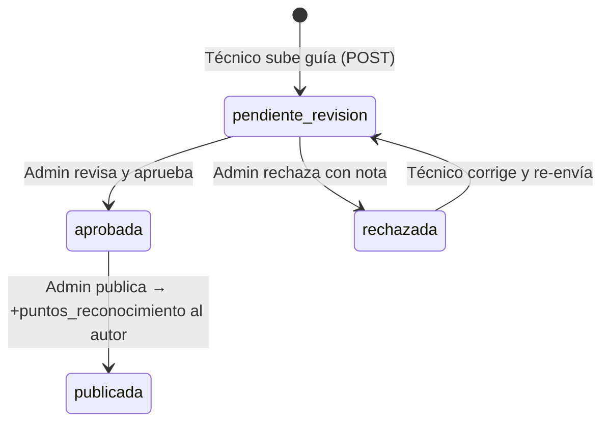

# WikiTecnica — Base de Conocimiento Técnico

**Archivo fuente:** `BackEnd/Wiki/models.py`  
**Hereda de:** `ModeloBase`  
**Tabla BD:** `wiki_tecnica`  
**Propósito:** Repositorio de guías técnicas generadas por los propios técnicos del sistema. Incluye un flujo de aprobación y un mecanismo de reconocimiento mediante gamificación.

---

## Campos

| Campo | Tipo Django | Nulo | Default | Descripción |
|---|---|---|---|---|
| `autor` | `ForeignKey(Usuarios)` | No | — | Técnico que escribió y subió la guía. `PROTECT` |
| `casino_origen` | `ForeignKey(Casino)` | Sí | `None` | Sucursal donde se originó la solución. `SET_NULL` |
| `modelo_relacionado` | `ForeignKey(ModeloMaquina)` | No | — | Modelo de máquina al que aplica la guía. `CASCADE` |
| `titulo_guia` | `CharField(200)` | No | — | Título descriptivo del problema/procedimiento |
| `categoria` | `CharField(50)` | No | `'reparacion'` | Tipo de documento (choices) |
| `archivo_pdf` | `FileField` | No | — | Ruta al PDF en `wiki_tecnica/pdfs/` |
| `estado` | `CharField(30)` | No | `'pendiente_revision'` | Ciclo de vida (choices). Indexado |
| `puntos_reconocimiento` | `PositiveIntegerField` | No | `0` | Puntos asignados por el admin al publicar |
| `revisada_por` | `ForeignKey(Usuarios)` | Sí | `None` | Admin que revisó. `SET_NULL` |
| `fecha_revision` | `DateTimeField` | Sí | `None` | Timestamp de la revisión |
| `nota_revision` | `TextField` | Sí | `None` | Comentario del revisor |
| *+ campos heredados de ModeloBase* | | | | |

---

## Choices

### `CATEGORIA_GUIA_CHOICES`
| Valor | Etiqueta |
|---|---|
| `reparacion` | Guía de Reparación |
| `configuracion` | Manual de Configuración |
| `limpieza` | Procedimiento de Limpieza |
| `error_code` | Diccionario de Códigos de Error |

### `ESTADO_CHOICES`
| Valor | Etiqueta |
|---|---|
| `pendiente_revision` | Pendiente de Revisión |
| `aprobada` | Aprobada |
| `publicada` | Publicada → Los puntos se suman al autor |
| `rechazada` | Rechazada |

---

## Flujo de Aprobación



---

## Integración con Gamificación

Al publicar una guía (estado → `publicada`), la vista correspondiente debe sumar `puntos_reconocimiento` al `autor`. Este proceso es **manual** (el admin asigna los puntos en el formulario) y es disparado desde la lógica de la vista, no por una signal automática.

---

## class Meta

```python
class Meta:
    db_table = 'wiki_tecnica'
    verbose_name = "Guía Técnica"
    verbose_name_plural = "Wiki de Conocimiento"
    ordering = ['-creado_en']
```
