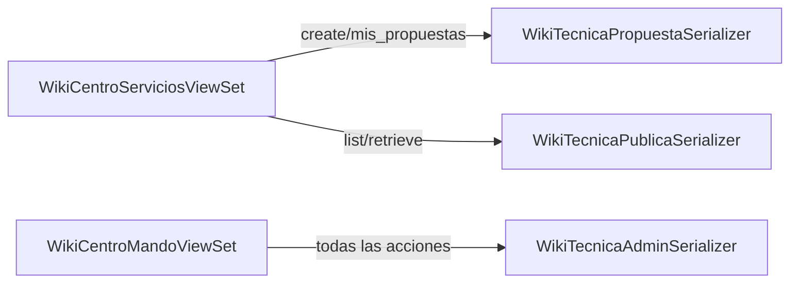

# WikiTecnicaSerializers — Wiki Técnica

**Archivo fuente:** `BackEnd/Wiki/serializers.py`

Define tres serializers para el mismo modelo `WikiTecnica`, cada uno adaptado a un actor y contexto diferente.

---

## Resumen de los tres serializers

| Serializer | Usado en | Actor | Campos |
|---|---|---|---|
| `WikiTecnicaPropuestaSerializer` | Centro de Servicios (create/mis-propuestas) | Técnico | Limitados, estado read-only |
| `WikiTecnicaPublicaSerializer` | Centro de Servicios (list/retrieve) | Técnico | Solo datos públicos |
| `WikiTecnicaAdminSerializer` | Centro de Mando | Administrador | `fields = '__all__'` + extras |

---

## WikiTecnicaPropuestaSerializer

**Propósito:** El técnico envía su propuesta de guía. Expone solo los campos que el técnico puede rellenar.

### Campos

| Campo | Tipo | Notas |
|---|---|---|
| `id` | Auto | Read-only |
| `titulo_guia` | CharField | Título de la guía |
| `categoria` | CharField | Choice del modelo |
| `archivo_pdf` | FileField | Archivo subido |
| `modelo_relacionado` | FK (int) | Modelo de máquina relacionado |
| `casino_origen` | FK (int) | Casino de origen (opcional) |
| `autor_nombre` | CharField | `source='autor.username'` — read-only |
| `modelo_nombre` | CharField | `source='modelo_relacionado.nombre_modelo'` — read-only |
| `casino_nombre` | CharField | `source='casino_origen.nombre'` — read-only, default `''` |
| `estado` | CharField | **Read-only** — siempre `pendiente_revision` al crear |
| `creado_en` | DateTimeField | Read-only |

**Campos blindados (read-only):** `estado`, `puntos_reconocimiento`, `revisada_por`, `fecha_revision`, `nota_revision`

> El técnico no puede elegir el estado ni asignarse puntos. Estos campos son controlados exclusivamente por el administrador.

---

## WikiTecnicaPublicaSerializer

**Propósito:** Lectura pública de guías ya publicadas en el Centro de Servicios.

### Campos

| Campo | Tipo | Notas |
|---|---|---|
| `id` | Auto | |
| `titulo_guia` | CharField | |
| `categoria` | CharField | |
| `categoria_display` | CharField | `source='get_categoria_display'` — label legible |
| `archivo_pdf` | FileField | URL del PDF |
| `modelo_nombre` | CharField | `source='modelo_relacionado.nombre_modelo'` |
| `casino_nombre` | CharField | `source='casino_origen.nombre'`, default `'Global'` |
| `autor_nombre` | CharField | `source='autor.username'` |
| `autor_nombres_completos` | SerializerMethodField | Nombres y apellido paterno |
| `puntos_reconocimiento` | IntegerField | Puntos otorgados por la guía |
| `fecha_revision` | DateTimeField | Cuándo fue publicada |
| `creado_en` | DateTimeField | |

**Todos los campos son `read_only`** (el Meta los declara explícitamente).

### `get_autor_nombres_completos`

```python
def get_autor_nombres_completos(self, obj):
    u = obj.autor
    return f"{u.nombres} {u.apellido_paterno}"
```

---

## WikiTecnicaAdminSerializer

**Propósito:** Vista completa del administrador. `fields = '__all__'` más campos extra.

### Campos adicionales

| Campo | `source` / método | Descripción |
|---|---|---|
| `autor_nombre` | `autor.username` | Username del autor |
| `autor_nombres_completos` | `get_autor_nombres_completos` | Nombre completo |
| `modelo_nombre` | `modelo_relacionado.nombre_modelo` | Nombre del modelo |
| `casino_nombre` | `casino_origen.nombre` | Nombre del casino, default `'Global'` |
| `revisado_por_nombre` | `revisada_por.username` | Admin que revisó, default `''` |
| `categoria_display` | `get_categoria_display` | Label legible del choice |
| `estado_display` | `get_estado_display` | Label legible del estado |
| `puntos_gamificacion_autor` | `get_puntos_gamificacion_autor` | Puntos actuales del autor |

### `get_puntos_gamificacion_autor`

```python
def get_puntos_gamificacion_autor(self, obj):
    return obj.autor.puntos_gamificacion
```

Permite al administrador ver cuántos puntos disponibles tiene el autor **en el momento de revisar** la guía, para contextualizar la decisión de publicación.

**Campos de solo lectura del Meta:** `autor`, `creado_en`, `modificado_en`, `creado_por`, `modificado_por`

---

## Diagrama de uso por ViewSet


