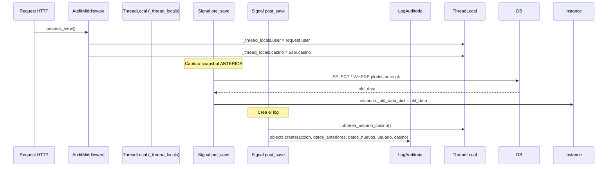

# AuditoriaGlobalSignals — Sistema de Auditoría Automática

**Archivo fuente:** `BackEnd/AuditoriaGlobal/signals.py`  
**Módulo auxiliar:** `BackEnd/AuditoriaGlobal/middleware.py`  
**Propósito:** Intercepta automáticamente TODOS los eventos `pre_save`, `post_save` y `post_delete` de cualquier modelo registrado en Django y genera un `LogAuditoria` inmutable. El sistema de auditoría es invisible para las vistas: no requiere código extra en cada viewset.

---

## Arquitectura del Sistema



---

## Middleware: `AuditMiddleware`

**Archivo:** `BackEnd/AuditoriaGlobal/middleware.py`

```python
class AuditMiddleware(MiddlewareMixin):
    def process_request(self, request):
        _thread_locals.user = None   # Limpiar al inicio de cada request
        _thread_locals.casino = None

    def process_view(self, request, view_func, view_args, view_kwargs):
        # process_view se ejecuta DESPUÉS de la autenticación DRF
        user = getattr(request, 'user', None)
        if user and user.is_authenticated:
            _thread_locals.user = user
            if hasattr(user, 'casino'):
                _thread_locals.casino = user.casino

    def process_response(self, request, response):
        _thread_locals.user = None   # Limpiar al final para evitar cruce de hilos
        _thread_locals.casino = None
        return response
```

**Por qué `process_view` en vez de `process_request`:** En Django REST Framework, el objeto `request.user` se resuelve en las vistas, no en el middleware estándar. `process_view` se ejecuta DESPUÉS de que DRF ha autenticado al usuario con `SessionTokenMiddleware`, por lo que `request.user` ya tiene el valor correcto.

**Por qué Thread Local:** Django puede servir múltiples requests concurrentemente (en production con Gunicorn/uWSGI). El `threading.local()` garantiza que el usuario del Request A no "contamina" el contexto del Request B, porque cada hilo tiene su propia copia de `_thread_locals`.

---

## Signal: `auditoria_pre_save`

**Trigger:** `@receiver(pre_save)` — Se ejecuta ANTES de cualquier `save()`

```python
@receiver(pre_save)
def auditoria_pre_save(sender, instance, **kwargs):
    nombre_tabla = sender.__name__
    if nombre_tabla in IGNORE_MODELS:
        return
    
    if not instance.pk:
        instance._old_data_dict = None  # Creación nueva: no hay datos anteriores
        return
    
    try:
        old_instance = sender.objects.get(pk=instance.pk)
        instance._old_data_dict = model_to_dict(old_instance)
    except sender.DoesNotExist:
        instance._old_data_dict = None
```

**Clave:** El snapshot se guarda en `instance._old_data_dict` como atributo temporal de la instancia. Esto evita una segunda consulta a la DB en `post_save`. El atributo comienza con `_` para indicar que es privado/temporal.

---

## Signal: `auditoria_post_save`

**Trigger:** `@receiver(post_save)` — Se ejecuta DESPUÉS de cualquier `save()`

**Lógica:**
1. Determina si es `CREATE` (by `created=True`) o `UPDATE`
2. Recupera `usuario` y `casino` del thread local
3. En `UPDATE`, si los datos anteriores y nuevos son idénticos → **no registra el log** (evita spam de logs vacíos)
4. Serializa ambos snapshots como `JSONField`
5. Crea un `LogAuditoria`

```python
# Optimización: No guardar UPDATE sin cambios reales
if accion == 'UPDATE' and old_data_dict == new_data_dict:
    return
```

---

## Signal: `auditoria_post_delete`

**Trigger:** `@receiver(post_delete)` — Se ejecuta DESPUÉS de un `delete()`

- Registra la acción `DELETE`
- Guarda el último estado del registro en `datos_anteriores`
- `datos_nuevos` queda en `None` (ya no existe el registro)

---

## Función `model_to_dict`

```python
def model_to_dict(instance):
    opts = instance._meta
    data = {}
    for f in opts.concrete_fields:
        val = f.value_from_object(instance)
        data[f.name] = val
    return data
```

Itera sobre `concrete_fields` (campos físicos de la tabla, excluye M2M y computed) y extrae su valor. La serialización se hace con `DjangoJSONEncoder` para manejar `datetime`, `Decimal`, `UUID`, etc.

---

## Modelos Excluidos (`IGNORE_MODELS`)

```python
IGNORE_MODELS = [
    'LogAuditoria',    # Evita recursividad infinita
    'Session',         # Ruido de sesiones Django
    'LogEntry',        # Logs del admin django integrado
    'ContentType',     # Metadatos internos
    'Permission',      # Permisos internos
    'Group',           # Grupos internos
]
```

---

## Configuración en `settings.py`

```python
MIDDLEWARE = [
    ...
    'Usuarios.middleware.SessionTokenMiddleware',  # ← Autentica primero
    'AuditoriaGlobal.middleware.AuditMiddleware',  # ← Luego captura usuario
    ...
]
```

El orden es **crítico**: `SessionTokenMiddleware` debe aparecer antes de `AuditMiddleware` para que `request.user` esté disponible.
