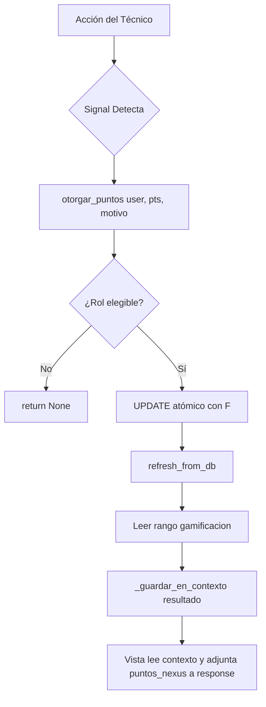

# GamificacionSignals — Sistema RPG de Puntos Automáticos

**Archivo fuente:** `BackEnd/Gamificacion/signals_gamificacion.py`  
**Propósito:** Motor de gamificación automática del sistema NEXUS. Otorga puntos a los técnicos cuando realizan acciones relevantes. Usa `F()` expressions + `update()` directo para operaciones atómicas y sin race conditions.

---

## Arquitectura General



---

## Roles Elegibles

```python
ROLES_GAMIFICACION = {'TECNICO', 'SUP SISTEMAS'}
```

Solo estos roles acumulan puntos. GERENCIA, ADMINISTRADOR y OBSERVADOR no participan.

---

## Contexto Thread-Local para Respuesta en Tiempo Real

```python
_ctx = threading.local()

def _guardar_en_contexto(resultado: dict):
    """Acumula puntos del request actual en el thread local."""
    ...

def get_puntos_context() -> dict | None:
    """Lee el resultado acumulado en el thread actual."""
    return getattr(_ctx, 'puntos_nexus', None)

def limpiar_puntos_context():
    """Limpia el contexto del thread al final de la vista."""
    _ctx.puntos_nexus = None
```

**Problema que resuelve:** Las signals corren en el mismo hilo de ejecución que la vista. Cuando el técnico cierra un ticket y la signal otorga puntos, el frontend necesita saber cuántos puntos ganó (para el toast de celebración). El contexto thread-local es un mecanismo de comunicación entre la signal y la vista sin pasar objetos entre funciones.

**Uso en las vistas:**
```python
# Al inicio de la acción
limpiar_puntos_context()

# ... procesar la lógica normal ...

# Al final, adjuntar puntos a la respuesta
puntos = get_puntos_context()
if puntos:
    response.data['puntos_nexus'] = puntos
```

---

## Función Central: `otorgar_puntos`

```python
def otorgar_puntos(user, puntos: int, motivo: str) -> dict | None:
```

### Parámetros
| Parámetro | Tipo | Descripción |
|---|---|---|
| `user` | `Usuarios` \| `int` \| `None` | Instancia del usuario o su PK. Acepta ambos para flexibilidad |
| `puntos` | `int` | Cantidad a otorgar. Debe ser > 0 |
| `motivo` | `str` | Descripción del logro (aparece en el log y el toast) |

### Retorno
```python
{
    'puntos_otorgados': 2,
    'puntos_totales': 154,
    'puntos_historico': 250,
    'rango_nivel': 3,
    'rango_titulo': 'Técnico de Soporte',
    'rango_insignia': '🔶🔶',
    'progreso_pct': 18.0,
    'puntos_sig': 600,
    'usuario': 'rgarcia',
    'motivo': 'ticket cerrado correctamente',
    'mensaje_nexus': '🏅 +2 puntos NEXUS — ticket cerrado correctamente',
}
```

### La operación atómica (anti race condition)

```python
Usuarios.objects.filter(pk=user_id).update(
    puntos_gamificacion=F('puntos_gamificacion') + puntos,
    puntos_gamificacion_historico=F('puntos_gamificacion_historico') + puntos,
)
```

**Por qué `F()` + `update()` y no `user.save()`:**

- `update()` genera un SQL `UPDATE usuarios SET puntos=puntos+N WHERE id=X` — no hay lectura previa en Python
- Si dos workers ejecutan simultáneamente la misma signal, ambos leen `puntos=100`, uno guarda `102`, el otro también guarda `102` → se pierden 2 puntos
- Con `F()`, el cálculo ocurre en la DB: `SET puntos = puntos + 2`. Ambos workers generan `UPDATE` correctos que se serializan en la DB

---

## Tabla de Puntos por Acción

| Acción | Signal | Puntos | Receptor |
|---|---|---|---|
| Ticket cerrado | `gamif_ticket_cerrado` | +2 | `tecnico_asignado` |
| Bitácora técnica creada | `gamif_bitacora_creada` | +2 | `usuario_tecnico` |
| Mantenimiento preventivo registrado | `gamif_mantenimiento_creado` | **+50** | `tecnico_responsable` |
| Tarea especial completada | `gamif_tarea_completada` | +20 | `asignado_a` |
| Relevo de turno documentado | `gamif_relevo_creado` | +2 | `tecnico_saliente` |
| Reporte EvolucionNexus enviado | `gamif_evolucion_creada` | +15 | `usuario` |

---

## Detalle de Cada Signal

### 1. `gamif_ticket_cerrado` (post_save → Tickets.Ticket)

**Prerequisito:** Hay una signal hermana `gamif_ticket_capturar_estado` (pre_save) que captura el estado anterior y lo guarda en `instance._estado_anterior`. La signal de puntos lo lee:

```python
estado_anterior = getattr(instance, '_estado_anterior', None)
if instance.estado_ciclo == 'cerrado' and estado_anterior != 'cerrado':
    otorgar_puntos(instance.tecnico_asignado, 2, 'ticket cerrado correctamente')
```

**Por qué comparar con el estado anterior:** Evita otorgar puntos si el ticket ya estaba cerrado y solo se actualizó otra propiedad (como notas).

### 2. `gamif_bitacora_creada` (post_save → BitacoraTecnica)

Solo se activa en `created=True`:
```python
if created:
    otorgar_puntos(instance.usuario_tecnico, 2, 'entrada de bitácora técnica registrada')
```

### 3. `gamif_mantenimiento_creado` (post_save → MantenimientosPreventivos)

+50 pts al registrar (la acción más valiosa del sistema). Solo en `created=True`:
```python
if created:
    otorgar_puntos(instance.tecnico_responsable, 50, 'mantenimiento preventivo registrado')
```

### 4. `gamif_tarea_completada` (post_save → TareasEspeciales.TareaEspecial)

Requiere dos signals encadenadas:
1. `gamif_tarea_capturar_estado` (pre_save): guarda `instance._estatus_anterior`
2. `gamif_tarea_completada` (post_save): verifica transición y otorga puntos

```python
if instance.estatus == 'completada' and estatus_anterior != 'completada':
    otorgar_puntos(instance.asignado_a, 20, 'tarea especial completada')
```

### 5. `gamif_relevo_creado` (post_save → RelevosTurnos.RelevoTurno)

```python
if created:
    otorgar_puntos(instance.tecnico_saliente, 2, 'relevo de turno documentado')
```

### 6. `gamif_evolucion_creada` (post_save → EvolucionNexus.EvolucionNexus)

```python
if created:
    otorgar_puntos(instance.usuario, 15, 'reporte/propuesta de evolución NEXUS enviado')
```

---

## Registro en INSTALLED_APPS

Las signals de gamificación se conectan automáticamente porque el módulo `Gamificacion` está en `INSTALLED_APPS`. No requiere un `AppConfig.ready()` explícito si el archivo se importa como parte del paquete. Sin embargo, si se refactorizara, se debería conectar en:

```python
# Gamificacion/apps.py
class GamificacionConfig(AppConfig):
    def ready(self):
        import Gamificacion.signals_gamificacion  # noqa
```
