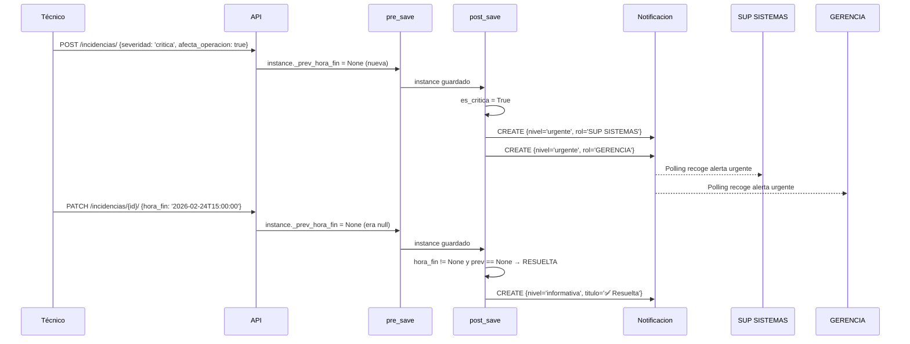

# IncidenciasSignals — Notificaciones Automáticas de Infraestructura

**Archivo fuente:** `BackEnd/IncidenciasInfraestructura/signals.py`  
**Propósito:** Genera notificaciones automáticas en el sistema cuando se registran incidencias de infraestructura. La severidad y el flag `afecta_operacion` determinan la urgencia y los destinatarios de la alerta.

---

## Señales Registradas

| Signal | Sender | Tipo | Propósito |
|---|---|---|---|
| `incidencia_snapshot_pre_save` | `IncidenciaInfraestructura` | pre_save | Captura el valor anterior de `hora_fin` |
| `incidencia_post_save` | `IncidenciaInfraestructura` | post_save | Genera las notificaciones según el evento |

---

## Signal 1: `incidencia_snapshot_pre_save` (pre_save)

```python
@receiver(pre_save, sender=IncidenciaInfraestructura)
def incidencia_snapshot_pre_save(sender, instance, **kwargs):
    if instance.pk:
        try:
            prev = IncidenciaInfraestructura.objects.get(pk=instance.pk)
            instance._prev_hora_fin = prev.hora_fin
        except IncidenciaInfraestructura.DoesNotExist:
            instance._prev_hora_fin = None
    else:
        instance._prev_hora_fin = None
```

**Por qué:** Para detectar si la incidencia **se está resolviendo** (cuando `hora_fin` pasa de `None` a un valor), necesitamos saber el estado ANTERIOR. Esta signal almacena ese valor en `instance._prev_hora_fin` antes de que el `save()` lo sobrescriba.

---

## Signal 2: `incidencia_post_save` (post_save)

### Lógica completa

```python
@receiver(post_save, sender=IncidenciaInfraestructura)
def incidencia_post_save(sender, instance, created, **kwargs):
    casino    = instance.casino
    severidad = instance.severidad
    es_critica = severidad in ('alta', 'critica') or instance.afecta_operacion
```

### Caso A — Incidencia NUEVA (`created=True`)

| Condición | Nivel | Prefijo | Destinatarios |
|---|---|---|---|
| `severidad in (alta, critica)` o `afecta_operacion=True` | `urgente` | 🚨 URGENTE | SUP SISTEMAS + GERENCIA |
| Cualquier otra | `alerta` | ⚠️ | SUP SISTEMAS |

### Caso B — Incidencia RESUELTA (`hora_fin` cambia de `None` a valor)

```python
prev_hora_fin = getattr(instance, '_prev_hora_fin', None)
if instance.hora_fin and not prev_hora_fin:
    # La incidencia acaba de ser resuelta
    _notificar_por_rol_y_casino(
        titulo  = "✅ Incidencia de Infraestructura Resuelta",
        nivel   = 'informativa',
        tipo    = 'infraestructura',
        casino  = casino,
        nombres_rol = ['SUP SISTEMAS', 'GERENCIA'],
    )
```

---

## Función Helper `_notificar_por_rol_y_casino`

```python
def _notificar_por_rol_y_casino(titulo, contenido, nivel, tipo, casino, nombres_rol):
    roles = Rol.objects.filter(nombre__in=nombres_rol)
    for rol in roles:
        Notificacion.objects.create(
            titulo        = titulo,
            contenido     = contenido,
            nivel         = nivel,
            tipo          = tipo,
            casino_destino= casino,
            rol_destino   = rol,
        )
```

Crea una `Notificacion` por cada rol destino. El modelo `Notificacion` después se filtra en su `get_queryset` para mostrarla solo a los usuarios con ese rol en ese casino.

---

## Flujo Completo


