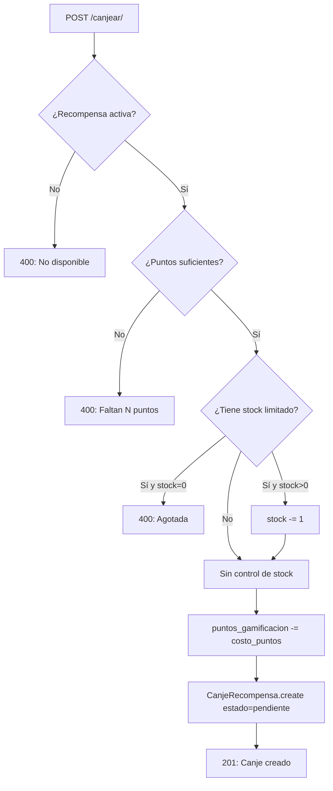

# GamificaciónViewSets — Tienda de Recompensas

**Archivo fuente:** `BackEnd/Gamificacion/views.py`  
**Clases:**
- `RecompensaGerenciaViewSet(viewsets.ModelViewSet)` — Panel de administración
- `RecompensaTecnicoViewSet(viewsets.ReadOnlyModelViewSet)` — Vista del técnico

**Base URLs:**
- `/api/gamificacion/tienda/` → Gerencia
- `/api/gamificacion/tienda-tecnico/` → Técnicos

---

## Control de Acceso

```python
_ROLES_TIENDA = {'GERENCIA', 'ADMINISTRADOR', 'DB ADMIN'}

def _tiene_acceso_tienda(user) -> bool:
    return user.rol.nombre in _ROLES_TIENDA
```

`_check_acceso(request)` es un helper interno usado en todos los endpoints de Gerencia. Si el usuario no está en `_ROLES_TIENDA`, devuelve directamente `403 FORBIDDEN`. Evita duplicar la verificación en cada acción.

---

## `RecompensaGerenciaViewSet` — Panel de Gerencia

### Endpoints

| Método | URL | Descripción |
|---|---|---|
| GET | `/api/gamificacion/tienda/` | Listar recompensas del casino del usuario |
| POST | `/api/gamificacion/tienda/` | Crear nueva recompensa |
| PUT/PATCH | `/api/gamificacion/tienda/{id}/` | Editar recompensa |
| DELETE | `/api/gamificacion/tienda/{id}/` | Eliminar recompensa |
| POST | `/api/gamificacion/tienda/{id}/toggle-activo/` | Activar/desactivar sin eliminar |
| GET | `/api/gamificacion/tienda/canjes/` | Historial de canjes del casino |
| POST | `/api/gamificacion/tienda/{id}/canjes/{canje_id}/entregar/` | Marcar canje como entregado |

### `get_queryset`

```python
if not _tiene_acceso_tienda(self.request.user):
    return RecompensaGamificacion.objects.none()
# Filtrada por casino del usuario logueado
return RecompensaGamificacion.objects.filter(casino=request.user.casino)
```

Gerencia solo ve las recompensas de **su propio casino**. Si no tiene acceso, devuelve QuerySet vacío (no 403).

### `perform_create`

```python
serializer.save(
    casino=self.request.user.casino,  # Casino auto-asignado
    creado_por=self.request.user.username,
    modificado_por=self.request.user.username,
)
```

### Acción: `toggle_activo` (POST)

Activa o desactiva `recompensa.activo`. Usa `save(update_fields=['activo', 'modificado_por'])`.

```json
// Respuesta
{"mensaje": "Recompensa \"Día libre\" activada correctamente."}
```

### Acción: `historial_canjes` (GET)

```python
canjes = CanjeRecompensa.objects.filter(
    recompensa__casino=request.user.casino
).select_related('usuario', 'recompensa').order_by('-creado_en')
```

Respuesta:
```json
{
  "total": 12,
  "canjes": [
    {
      "id": 1,
      "usuario": "jmartinez",
      "recompensa": "Día libre extra",
      "estado": "pendiente",
      "puntos_descontados": 500,
      "nota_gerencia": ""
    }
  ]
}
```

### Acción: `entregar_canje` (POST)

**URL:** `POST /api/gamificacion/tienda/{pk}/canjes/{canje_id}/entregar/`

Comprueba que el canje pertenece al casino de la gerencia, luego cambia `estado = 'entregado'`. No puede re-entregar (retorna `400` si ya fue entregado).

```json
// Body opcional
{"nota_gerencia": "Entregado el 15/01/2025"}
```

---

## `RecompensaTecnicoViewSet` — Vista del Técnico

### Endpoints

| Método | URL | Descripción |
|---|---|---|
| GET | `/api/gamificacion/tienda-tecnico/` | Recompensas activas disponibles |
| GET | `/api/gamificacion/tienda-tecnico/{id}/` | Detalle de una recompensa |
| POST | `/api/gamificacion/tienda-tecnico/{id}/canjear/` | Canjear recompensa |
| GET | `/api/gamificacion/tienda-tecnico/mis-canjes/` | Historial personal de canjes |
| GET | `/api/gamificacion/tienda-tecnico/mi-rango/` | Puntos y rango RPG del técnico |

### Acción: `canjear` (POST)

Flujo dentro de `transaction.atomic()`:



> `puntos_gamificacion_historico` (el que determina el rango) **no se toca**. El canje no hace retroceder de nivel al técnico.

#### Respuesta exitosa (201)
```json
{
  "mensaje": "¡Canje exitoso! \"Día libre\" está pendiente de entrega.",
  "puntos_restantes": 850,
  "puntos_historico": 1350,
  "rango_actual": {"nivel": 5, "titulo": "Técnico Experto", ...},
  "canje_id": 17
}
```

#### Error por puntos insuficientes (400)
```json
{
  "error": "No tienes suficientes puntos para canjear esta recompensa.",
  "puntos_disponibles": 300,
  "costo_requerido": 500,
  "faltan": 200
}
```

### Acción: `mi_rango` (GET)

```json
{
  "username": "jmartinez",
  "puntos_disponibles": 850,
  "puntos_historico": 1350,
  "rango": {
    "nivel": 5,
    "titulo": "Técnico Experto",
    "insignia": "★★★★★",
    "progreso_pct": 65.0,
    "puntos_sig": 1500
  }
}
```

---

## Relación entre los dos ViewSets

```
RecompensaGamificacion (creada por Gerencia)
        │
        ├── activo=True ──► visible para Técnicos en tienda-tecnico
        │
        └── CanjeRecompensa (creado por Técnico)
                │
                ├── estado=pendiente ──► Gerencia ve en /canjes/
                └── estado=entregado ──► cerrado por Gerencia
```
