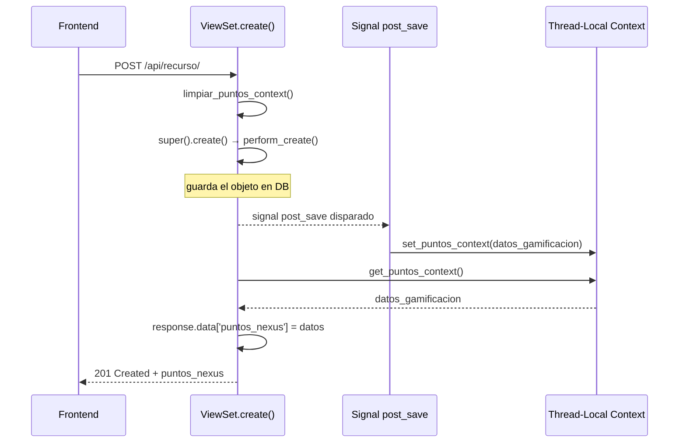

# MantenimientoPreventivoViewSet · RelevoTurnoViewSet · TareaEspecialViewSet

**Archivo fuente:** `BackEnd/MantenimientosPreventivos/views.py` · `BackEnd/RelevosTurnos/views.py` · `BackEnd/TareasEspeciales/views.py`

Estos tres ViewSets comparten el mismo patrón de gamificación y filtros simples. Se documentan juntos por concisos.

---

## MantenimientoPreventivoViewSet

**Base URL:** `/api/mantenimientos/`  
**Serializer:** `MantenimientoPreventivoSerializer`

### Endpoints

| Método | URL | Descripción |
|---|---|---|
| GET | `/api/mantenimientos/` | Listado (filtros: `?maquina=id`, `?casino=id`) |
| POST | `/api/mantenimientos/` | Registrar preventivo |
| GET | `/api/mantenimientos/{id}/` | Detalle |
| PATCH | `/api/mantenimientos/{id}/` | Actualizar |
| DELETE | `/api/mantenimientos/{id}/` | Eliminar |

### `get_queryset`

```python
queryset = MantenimientoPreventivo.objects.all().select_related(
    'maquina', 'tecnico_responsable', 'maquina__casino'
)
# Filtros opcionales
?maquina={id}   →  filter(maquina_id=maquina_id)
?casino={id}    →  filter(maquina__casino_id=casino_id)  # JOIN implícito
```

### `perform_create`

```python
serializer.save(creado_por=request.user.username)
```

### Integración con Gamificación

```python
def create(self, request, *args, **kwargs):
    limpiar_puntos_context()
    response = super().create(request, *args, **kwargs)
    puntos = get_puntos_context()
    if puntos:
        response.data['puntos_nexus'] = puntos
        limpiar_puntos_context()
    return response
```

### Efecto colateral (Signal)

Al crearse un `MantenimientoPreventivo`, el signal en [MantenimientosPreventivos/signals](../signals/MantenimientosPreventivos.md) actualiza `Maquina.ultimo_mantenimiento` con `update_fields=['ultimo_mantenimiento']` de forma automática.

---

## RelevoTurnoViewSet

**Base URL:** `/api/relevos/`  
**Serializer:** `RelevoTurnoSerializer`

### Endpoints

| Método | URL | Descripción |
|---|---|---|
| GET | `/api/relevos/` | Listado ordenado por `-hora_salida_real`, filtrable por `?casino=id` |
| POST | `/api/relevos/` | Documentar relevo |
| GET | `/api/relevos/{id}/` | Detalle |
| PATCH | `/api/relevos/{id}/` | Actualizar |
| DELETE | `/api/relevos/{id}/` | Eliminar |

### `get_queryset`

```python
queryset = RelevoTurno.objects.all().select_related(
    'casino', 'tecnico_saliente', 'tecnico_entrante'
).order_by('-hora_salida_real')

# Filtro opcional
?casino={id}  →  filter(casino_id=casino_id)
```

### `perform_create` / `create` (gamificación)

Misma lógica que `MantenimientoPreventivoViewSet`. `perform_create` registra `creado_por = request.user.username`.

---

## TareaEspecialViewSet

**Base URL:** `/api/tareas/`  
**Serializer:** `TareaEspecialSerializer`

### Endpoints

| Método | URL | Descripción |
|---|---|---|
| GET | `/api/tareas/` | Listado de tareas |
| POST | `/api/tareas/` | Crear tarea |
| GET | `/api/tareas/{id}/` | Detalle |
| PUT/PATCH | `/api/tareas/{id}/` | Actualizar (con auto-asignación) |
| DELETE | `/api/tareas/{id}/` | Eliminar |

### `perform_create`

```python
serializer.save(
    creado_por_usuario=self.request.user,   # FK al objeto Usuarios
    creado_por=self.request.user.username   # Texto para auditoría
)
```

### `perform_update` — Auto-Asignación

```python
def perform_update(self, serializer):
    instance = self.get_object()
    if not instance.asignado_a:
        # Si la tarea no tenía técnico asignado, el técnico que la actualiza
        # pasa a ser el responsable automáticamente
        serializer.save(
            asignado_a=self.request.user,
            modificado_por=self.request.user.username
        )
    else:
        serializer.save(modificado_por=self.request.user.username)
```

> **Regla de negocio:** La primera persona que actualiza una tarea sin asignar se auto-asigna como responsable.

### Integración con Gamificación (en update)

```python
def _update_con_puntos(self, request, *args, **kwargs):
    """Helper compartido por update() y partial_update()"""
    limpiar_puntos_context()
    kwargs['partial'] = kwargs.get('partial', False)
    response = super().update(request, *args, **kwargs)
    puntos = get_puntos_context()
    if puntos:
        response.data['puntos_nexus'] = puntos
        limpiar_puntos_context()
    return response

def update(self, request, *args, **kwargs):
    return self._update_con_puntos(request, *args, **kwargs)

def partial_update(self, request, *args, **kwargs):
    kwargs['partial'] = True
    return self._update_con_puntos(request, *args, **kwargs)
```

A diferencia de los otros ViewSets, **TareaEspecial** inyecta puntos en el `update` (al completar la tarea), no solo en `create`.

---

## Patrón Común de Gamificación

Los tres ViewSets utilizan el mismo patrón con el contexto thread-local de gamificación:


