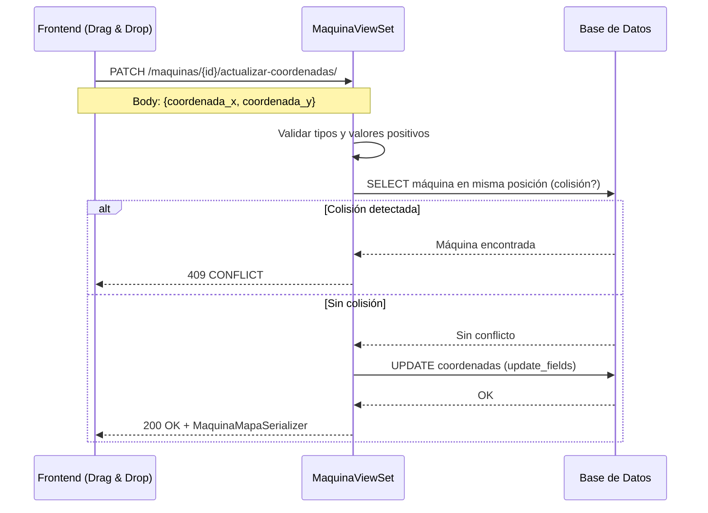

# MaquinaViewSet — Gestión de Máquinas

**Archivo fuente:** `BackEnd/Maquinas/views.py`  
**Clase:** `MaquinaViewSet(viewsets.ModelViewSet)`  
**Base URL:** `/api/maquinas/`  
**Serializer:** `MaquinaSerializer` (por defecto) / `MaquinaMapaSerializer` (endpoints de mapa)  
**Permisos:** `IsAuthenticated` (heredado de configuración global)

---

## Endpoints

| Método | URL | Descripción |
|---|---|---|
| GET | `/api/maquinas/` | Listado con filtros dinámicos |
| POST | `/api/maquinas/` | Crear nueva máquina |
| GET | `/api/maquinas/{id}/` | Detalle de una máquina |
| PUT/PATCH | `/api/maquinas/{id}/` | Actualizar máquina |
| DELETE | `/api/maquinas/{id}/` | Eliminar máquina |
| PATCH | `/api/maquinas/{id}/switch-estado/` | Toggle `esta_activo` |
| GET | `/api/maquinas/lista/` | **Todas** las máquinas (incluyendo inactivas) |
| GET | `/api/maquinas/lista-por-casino/{casino_id}/` | Máquinas de un casino + estadísticas |
| POST | `/api/maquinas/{id}/incrementar-fallas/` | Incremento atómico del contador de fallas |
| PATCH | `/api/maquinas/{id}/actualizar-coordenadas/` | Actualizar posición en el mapa |
| GET | `/api/maquinas/mapa-completo/` | Grid completo del casino para el Digital Twin |

---

## `get_queryset` — Filtros Dinámicos

```python
queryset = Maquina.objects.filter(esta_activo=True).select_related(
    'modelo', 'casino', 'modelo__proveedor'
).prefetch_related('denominaciones')
```

**Parámetros de query:**

| Parámetro | Campo | Tipo de lookup |
|---|---|---|
| `uid` | `uid_sala__iexact` | Exacto, case-insensitive |
| `casino` | `casino_id` | Exacto |
| `estado` | `estado_actual` | Exacto |
| `search` | uid_sala, numero_serie, juego, modelo.nombre_modelo/nombre_producto | `icontains` en Q() OR |

**Ejemplo:**
```
GET /api/maquinas/?search=Dragon&casino=3&estado=OPERATIVA
```

---

## `partial_update` — Lógica Bifurcada

```python
def partial_update(self, request, *args, **kwargs):
    instance = self.get_object()

    # CASO ESPECIAL: solo estado_actual (y ≤ 2 campos en el body)
    if 'estado_actual' in request.data and len(request.data) <= 2:
        nuevo_estado = request.data.get('estado_actual')
        estados_validos = [choice[0] for choice in Maquina.ESTADOS_CHOICES]
        if nuevo_estado not in estados_validos:
            raise ValidationError(...)
        
        instance.estado_actual = nuevo_estado
        instance.save(update_fields=['estado_actual', 'modificado_por', 'modificado_en'])
        # Omite full_clean() → actualización ultrarrápida

    # CASO NORMAL: delega al serializer completo
    else:
        return super().partial_update(request, *args, **kwargs)
```

> **Optimización clave:** El cambio de estado rápido (desde el toggle del frontend) evita la validación completa del modelo y escribe solo 3 campos. Para actualizaciones completas se ejecuta el ciclo normal con `full_clean()`.

---

## Acción: `lista_por_casino` (GET)

**URL:** `GET /api/maquinas/lista-por-casino/{casino_id}/`

Devuelve las máquinas activas del casino **más estadísticas** precalculadas para gráficas:

```json
{
  "maquinas": [...],
  "estadisticas": {
    "total": 45,
    "danadas": 3,
    "porcentaje_danadas": 6.67
  }
}
```

Las máquinas en estado `DAÑADA` o `DAÑADA_OPERATIVA` se acumulan en `danadas`.

---

## Acción: `incrementar_fallas` (POST)

**URL:** `POST /api/maquinas/{id}/incrementar-fallas/`

Usa `F()` expression para incremento atómico sin condición de carrera:

```python
Maquina.objects.filter(pk=maquina.pk).update(
    contador_fallas=F('contador_fallas') + 1,
    modificado_por=username
)
maquina.refresh_from_db()
```

### Respuesta
```json
{
  "mensaje": "Contador de fallas incrementado correctamente",
  "contador_fallas": 8,
  "uid_sala": "M042",
  "maquina": { ... }
}
```

---

## Endpoints de Mapa Interactivo (Digital Twin)

### `actualizar_coordenadas` (PATCH)

**URL:** `PATCH /api/maquinas/{id}/actualizar-coordenadas/`  
**Body:** `{ "coordenada_x": 5, "coordenada_y": 3 }`

Flujo de validaciones:
1. Verifica que `coordenada_x` y `coordenada_y` estén presentes
2. Convierte a `int`, rechaza si falla
3. Rechaza coordenadas negativas
4. **Verifica colisión:** busca otra máquina activa en mismo casino, piso, sala y coordenadas
   - Si colisión → `409 CONFLICT`
5. `save(update_fields=[...])` omite `full_clean()` por diseño
6. Retorna `MaquinaMapaSerializer` (solo datos de posición)

> `(0, 0)` es la posición especial "sin asignar" — se permite sin verificar colisión.

---

### `mapa_completo` (GET)

**URL:** `GET /api/maquinas/mapa-completo/?casino_id=1&piso=PISO_1&area=SALA_A`

Agrega en una sola respuesta:
- Configuración del grid del casino (`grid_width`, `grid_height`)
- Listas de pisos y áreas disponibles (para los selectores del frontend)
- Catálogo de `PISO_CHOICES` y `SALA_CHOICES`
- Filtros activos aplicados
- Todas las máquinas con posición (serializer ligero)

```json
{
  "casino": {
    "id": 1,
    "nombre": "Casino Centro",
    "grid_width": 20,
    "grid_height": 15
  },
  "pisos_disponibles": ["PISO_1", "PISO_2"],
  "areas_disponibles": ["SALA_A", "SALA_B"],
  "piso_choices": [{"value": "PISO_1", "label": "Piso 1"}, ...],
  "sala_choices": [...],
  "filtros_activos": {"piso": "PISO_1", "area": null},
  "total": 23,
  "maquinas": [
    {"id": 1, "uid_sala": "M001", "coordenada_x": 3, "coordenada_y": 7, ...},
    ...
  ]
}
```

---

## Diagrama de Flujo — Actualización de Coordenadas


