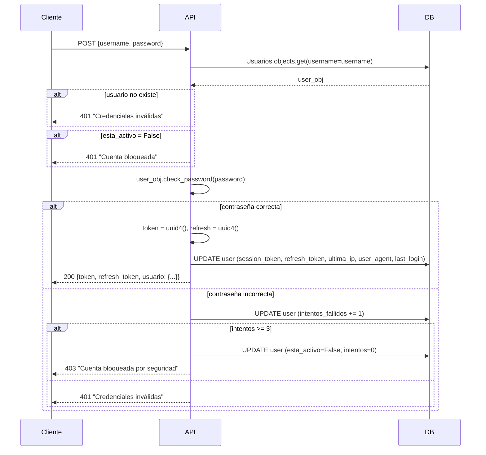

# UsuariosViewSet — Gestión de Usuarios y Autenticación

**Archivo fuente:** `BackEnd/Usuarios/views.py`  
**Clase:** `UsuariosViewSet(viewsets.ModelViewSet)`  
**Base URL:** `/api/usuarios/` (configurada en `BackEnd/urls.py`)  
**Serializer:** `UsuariosSerializer`  
**Permisos:** `IsAuthenticated` (por defecto) excepto endpoints de login/refresh/EULA

---

## Endpoints Generados

| Método | URL | Acción | Permisos | Descripción |
|---|---|---|---|---|
| GET | `/api/usuarios/` | `list` | Auth | Usuarios activos |
| POST | `/api/usuarios/` | `create` | Auth | Crear usuario |
| GET | `/api/usuarios/{id}/` | `retrieve` | Auth | Detalle de usuario |
| PUT | `/api/usuarios/{id}/` | `update` | Auth | Actualizar usuario completo |
| PATCH | `/api/usuarios/{id}/` | `partial_update` | Auth | Actualizar parcial |
| DELETE | `/api/usuarios/{id}/` | `destroy` | Auth | Eliminar usuario |
| GET | `/api/usuarios/lista/` | `lista` | Auth | Todos (incluyendo inactivos) |
| GET | `/api/usuarios/lista-por-casino/{casino_id}/` | `lista_por_casino` | Auth | Usuarios de un casino |
| POST | `/api/usuarios/login/` | `login` | Público | Login con username/password |
| POST | `/api/usuarios/refresh/` | `refresh_token` | Público | Renovar session token |
| PATCH | `/api/usuarios/{id}/switch-estado/` | `switch_estado` | Auth | Activar/desactivar usuario |
| PATCH | `/api/usuarios/{id}/aceplisencia/` | `aceptar_eula` | Público | Aceptar EULA |
| GET | `/api/usuarios/dashboard-stats/` | `dashboard_stats` | Auth | KPIs del dashboard |

---

## `get_queryset`

```python
def get_queryset(self):
    return Usuarios.objects.filter(esta_activo=True).select_related('rol', 'casino')
```

Solo devuelve usuarios activos. El `select_related` evita N+1 queries al acceder a `rol.nombre` y `casino.nombre` en el serializer.

---

## Acción: `login` (POST)

**URL:** `POST /api/usuarios/login/`  
**Permisos:** Sin autenticación (`permission_classes=[]`)

### Flujo de Autenticación NEXUS



### Respuesta exitosa
```json
{
    "message": "Login exitoso",
    "token": "550e8400-e29b-41d4-a716-446655440000",
    "refresh_token": "6ba7b810-9dad-11d1-80b4-00c04fd430c8",
    "usuario": {
        "id": 1,
        "username": "rgarcia",
        "casino_nombre": "Casino Monterrey Norte",
        "rol_nombre": "TECNICO",
        "rango_gamificacion": {...},
        ...
    }
}
```

---

## Acción: `refresh_token` (POST)

**URL:** `POST /api/usuarios/refresh/`  
**Permisos:** Sin autenticación (`permission_classes=[]`)

```python
# Entrada
{"refresh_token": "6ba7b810-..."}

# Salida
{"token": "nuevo_uuid", "refresh_token": "nuevo_uuid"}
```

Genera un nuevo par de tokens sin requerir contraseña. El token anterior queda invalidado.

---

## Acción: `lista_por_casino` (GET)

**URL:** `GET /api/usuarios/lista-por-casino/{casino_id}/`

- Filtra por `casino_id`
- **Excluye** usuarios con `rol__nombre='ADMINISTRADOR'` (seguridad: el admin general no debe verse en listados de salas)
- Retorna objeto con `usuarios` (array) y `estadisticas` (`{total, activos, inactivos}`)

---

## Acción: `switch_estado` (PATCH)

**URL:** `PATCH /api/usuarios/{id}/switch-estado/`

```python
# Búsqueda en .all() no en get_queryset() (que filtra activos)
usuario = get_object_or_404(ModeloUsuario.objects.all(), pk=pk)
usuario.esta_activo = not usuario.esta_activo
```

**Por qué buscar en `.all()`:** Si el usuario ya está inactivo (`esta_activo=False`), el `get_queryset` lo filtraría y retornaría 404. Al buscar en `.all()` se puede reactivar un usuario inactivo.

---

## Acción: `aceptar_eula` (PATCH)

**URL:** `PATCH /api/usuarios/{id}/aceplisencia/`  
**Permisos:** Sin autenticación (`permission_classes=[]`)

Establece `EULAAceptada = True`. No requiere auth porque se ejecuta antes del primer login completo.

---

## Acción: `dashboard_stats` (GET)

**URL:** `GET /api/usuarios/dashboard-stats/`

Retorna KPIs globales para el panel de administración:

```json
{
    "kpis": {
        "usuarios_activos": 45,
        "tickets_pendientes": 12,
        "tickets_criticos": 3,
        "reportes_evolucion": 7
    },
    "actividad_reciente": [...]
}
```

---

## `perform_create` / `perform_update`

```python
def perform_create(self, serializer):
    creado_por = self.request.user.username if self.request.user.is_authenticated else 'system'
    serializer.save(creado_por=creado_por)

def perform_update(self, serializer):
    modificado_por = self.request.user.username if self.request.user.is_authenticated else 'system'
    serializer.save(modificado_por=modificado_por)
```

Asegura que los campos de auditoría `creado_por` y `modificado_por` siempre se registren.
