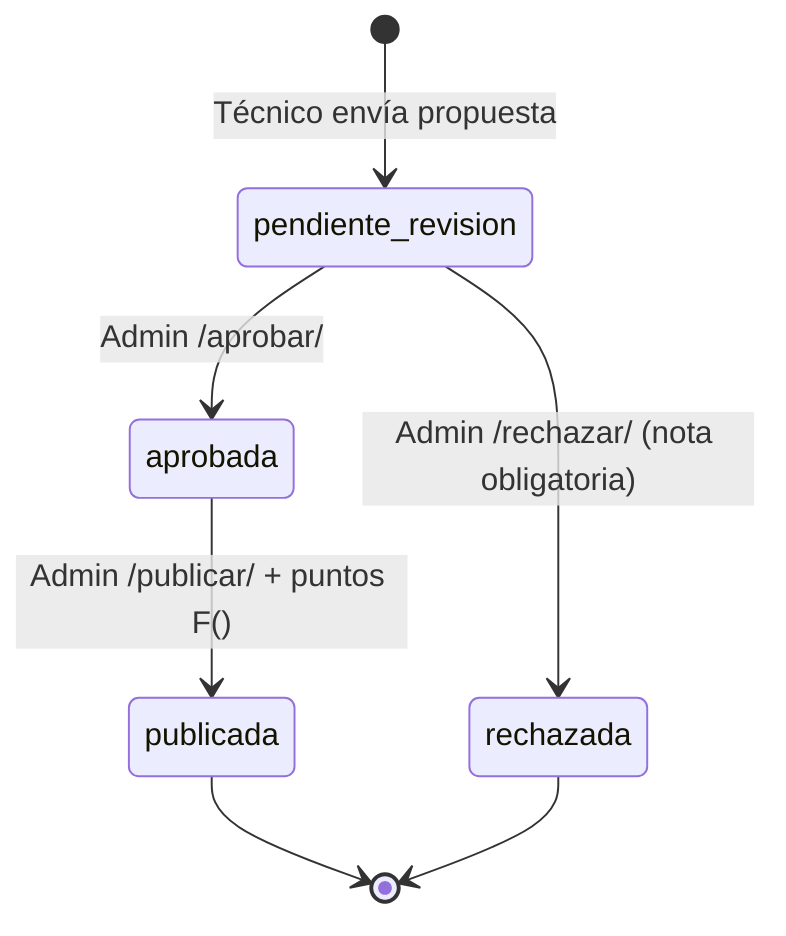

# WikiViewSets — Wiki Técnica

**Archivo fuente:** `BackEnd/Wiki/views.py`  
**Clases:**
- `WikiCentroMandoViewSet(viewsets.ModelViewSet)` — Administrador
- `WikiCentroServiciosViewSet(viewsets.ModelViewSet)` — Técnicos

**Base URLs:**
- `/api/wiki/centro-mando/` → Administrador
- `/api/wiki/centro-servicios/` → Técnicos

---

## WikiCentroMandoViewSet

### Acceso

Solo usuarios con `rol.nombre == 'ADMINISTRADOR'`. Si otro rol accede, `get_queryset` devuelve `WikiTecnica.objects.none()`.

```python
def _verificar_admin(self, request):
    if request.user.rol.nombre != 'ADMINISTRADOR':
        return Response({'error': 'Acceso denegado.'}, status=403)
    return None
```

### Endpoints

| Método | URL | Descripción |
|---|---|---|
| GET | `/api/wiki/centro-mando/` | Listar todas las guías (cualquier estado) |
| DELETE | `/api/wiki/centro-mando/{id}/` | Eliminar guía físicamente |
| GET | `/api/wiki/centro-mando/pendientes/` | Guías en `pendiente_revision` |
| POST | `/api/wiki/centro-mando/{id}/aprobar/` | Aprobar guía |
| POST | `/api/wiki/centro-mando/{id}/publicar/` | Publicar + otorgar puntos al autor |
| POST | `/api/wiki/centro-mando/{id}/rechazar/` | Rechazar con obligatoria nota |

---

### Flujo de estados de una guía



---

### `publicar` — Acción más compleja

**Body:**
```json
{
  "puntos_reconocimiento": 50,
  "nota_revision": "Excelente guía."
}
```

**Flujo:**
1. Verificar que el usuario es `ADMINISTRADOR`
2. Validar que la guía no está ya publicada
3. Validar `puntos_reconocimiento` (entero ≥ 0)
4. Actualizar campos en la guía: `estado='publicada'`, `revisada_por`, `fecha_revision`, `nota_revision`
5. Otorgar puntos al autor con `F()` atómico:

```python
Usuarios.objects.filter(pk=guia.autor.pk).update(
    puntos_gamificacion=F('puntos_gamificacion') + puntos,
    puntos_gamificacion_historico=F('puntos_gamificacion_historico') + puntos,
)
guia.autor.refresh_from_db(fields=['puntos_gamificacion', 'puntos_gamificacion_historico'])
```

6. Construir objeto `puntos_nexus` con datos de rango e insignia del autor

**Respuesta exitosa:**
```json
{
  "mensaje": "¡La guía \"Cambio de Gabinete\" ha sido publicada! Se otorgaron 50 puntos a jmartinez.",
  "puntos_otorgados": 50,
  "puntos_totales_autor": 1400,
  "puntos_nexus": {
    "puntos_otorgados": 50,
    "puntos_totales": 1400,
    "puntos_historico": 1400,
    "rango_nivel": 6,
    "rango_titulo": "Técnico Senior",
    "rango_insignia": "★★★★★★",
    "progreso_pct": 40.0,
    "puntos_sig": 1600,
    "usuario": "jmartinez",
    "motivo": "guía técnica publicada: Cambio de Gabinete",
    "mensaje_nexus": "🏅 +50 puntos NEXUS — guía técnica publicada"
  }
}
```

### `rechazar` — Requiere nota

```python
nota = request.data.get('nota_revision', '').strip()
if not nota:
    return Response({'error': 'Debes proporcionar una nota...'}, status=400)
```

No se puede rechazar una guía ya `publicada`.

---

## WikiCentroServiciosViewSet

### Restricciones de diseño

```python
# Solo permite GET y POST (no PUT, PATCH, DELETE)
http_method_names = ['get', 'post', 'head', 'options']
```

Los técnicos pueden enviar propuestas y leer guías publicadas, pero no pueden editar ni eliminar.

### Endpoints

| Método | URL | Descripción |
|---|---|---|
| GET | `/api/wiki/centro-servicios/` | Guías publicadas (lectura pública) |
| POST | `/api/wiki/centro-servicios/` | Enviar nueva propuesta |
| GET | `/api/wiki/centro-servicios/mis-propuestas/` | Propuestas del técnico con estado |
| GET | `/api/wiki/centro-servicios/reglas/` | Texto informativo de reglas |

### Serializers dinámicos

```python
def get_serializer_class(self):
    if self.action in ('create', 'mis_propuestas'):
        return WikiTecnicaPropuestaSerializer   # Incluye campos de propuesta
    return WikiTecnicaPublicaSerializer          # Solo campos públicos
```

### `perform_create`

```python
serializer.save(
    autor=self.request.user,
    estado='pendiente_revision',   # Estado inicial siempre
    creado_por=self.request.user.username,
    modificado_por=self.request.user.username,
)
```

El técnico no puede elegir el estado inicial. Siempre queda en `pendiente_revision`.

### `mis_propuestas` (GET)

Devuelve todas las guías del técnico en cualquier estado, ordenadas por fecha de creación, con `WikiTecnicaPropuestaSerializer` (que incluye `nota_revision` para que el técnico vea el feedback del rechazo).

### `reglas` (GET)

Endpoint informativo. Devuelve las 3 reglas del Centro de Servicios en estructura JSON para renderizar en el frontend. No consulta la base de datos.

---

## `select_related` en ambos ViewSets

| ViewSet | Campos |
|---|---|
| `WikiCentroMandoViewSet` | `autor`, `casino_origen`, `modelo_relacionado`, `revisada_por` |
| `WikiCentroServiciosViewSet` | `autor`, `casino_origen`, `modelo_relacionado` |
