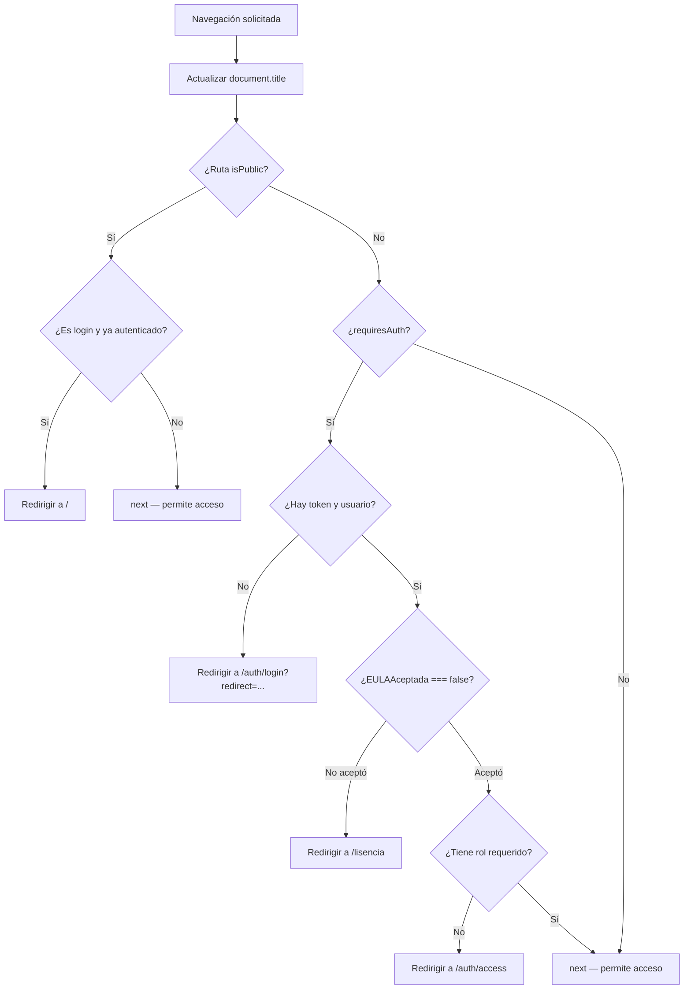

# Router — Enrutamiento y Guardias de Navegación

**Archivo fuente:** `FrontEnd/src/router/index.js`  
**Motor:** `createWebHistory` (HTML5 History API — sin `#` en la URL)

---

## Arquitectura: Rutas Dinámicas desde la Base de Datos

El router carga el menú desde el backend **antes de inicializarse**, usando una llamada `await` a nivel de módulo (top-level await):

```javascript
let menuData = [];
try {
    const res = await api.get('menus/activo/');
    if (res.data && res.data.length > 0) menuData = res.data;
} catch (e) {
    console.warn("No se pudo cargar menú desde API, usando arreglo vacío.");
}
```

> Si el backend no responde, el router arranca igualmente con cero rutas dinámicas (solo rutas estáticas).

### Generación de rutas dinámicas

```javascript
const viewModules = import.meta.glob('/src/views/**/*.vue');  // Carga perezosa de todos los .vue

const extractRoutes = (items) => {
    for (const item of items) {
        if (item.to && item.componentPath) {
            dynamicRoutes.push({
                path: item.to,
                component: viewModules[item.componentPath],  // Lazy load
                meta: {
                    title: item.title || item.label,
                    requiresAuth: true,
                    roles: item.roles || ['all']
                }
            });
        }
        if (item.items) extractRoutes(item.items); // Soporta submenús
    }
};
```

Cada elemento del menú en la DB tiene:
- `to` → path de la ruta (ej. `/maquinas`)
- `componentPath` → ruta al `.vue` (ej. `/src/views/CentroServicios/Maquinas.vue`)
- `roles` → array de roles con acceso (ej. `['TECNICO', 'ADMINISTRADOR']`)

---

## Rutas Estáticas

| Ruta | Nombre | Componente | `meta` |
|---|---|---|---|
| `/` (layout) | — | `AppLayout.vue` | — |
| `/profile` | `profile` | `Profile.vue` | `requiresAuth`, `roles: ['all']` |
| `/notificaciones/:id` | — | `NotificacionDetail.vue` | `requiresAuth`, `roles: ['all']` |
| `/pages/notfound` | `notfound` | `NotFound.vue` | `isPublic: true` |
| `/auth/login` | `login` | `Login.vue` | `isPublic: true` |
| `/auth/access` | `accessDenied` | `Access.vue` | `isPublic: true` |
| `/auth/error` | `error` | `Error.vue` | `isPublic: true` |
| `/lisencia` | `lisencia` | `lisencia.vue` | `isPublic: true`, `allowAuthenticatedAccess: true` |

---

## Guard de Navegación: `router.beforeEach`



### Comportamiento por `meta`

| `meta` | Descripción |
|---|---|
| `isPublic: true` | Accesible sin autenticación |
| `requiresAuth: true` | Requiere token+usuario en localStorage |
| `roles: ['all']` | Accesible para cualquier rol autenticado |
| `roles: ['ADMIN', 'GERENCIA']` | Solo para los roles listados |
| `allowAuthenticatedAccess: true` | Accesibles incluso si hay sesión (EULA) |

### Función de verificación de roles

```javascript
// En api.js
export const hasRoleAccess = (requiredRoles) => {
    if (!requiredRoles || requiredRoles.includes('all')) return true;
    const user = getUser();
    return user && requiredRoles.includes(user.rol_nombre);
};
```

---

## Verificación de EULA

Si `user.EULAAceptada === false`, el usuario es redirigido a `/lisencia` independientemente de la ruta que intente acceder. Esto ocurre en cada navegación hasta que acepte.

```javascript
if (user.EULAAceptada === false && to.path !== '/lisencia') {
    next({ path: '/lisencia', query: { redirect: to.fullPath } });
    return;
}
```

Tras aceptar la EULA, `acceptEULA()` en `api.js` actualiza `currentUser.EULAAceptada = true` en localStorage, por lo que el guard ya no redirige.

---

## Flujo de Login y Redirección

1. Usuario accede a `/maquinas` → guard detecta no autenticado → redirige a `/auth/login?redirect=/maquinas`
2. Usuario inicia sesión → `login()` guarda token en localStorage
3. Router redirige a `/maquinas` (desde el query param `redirect`)
