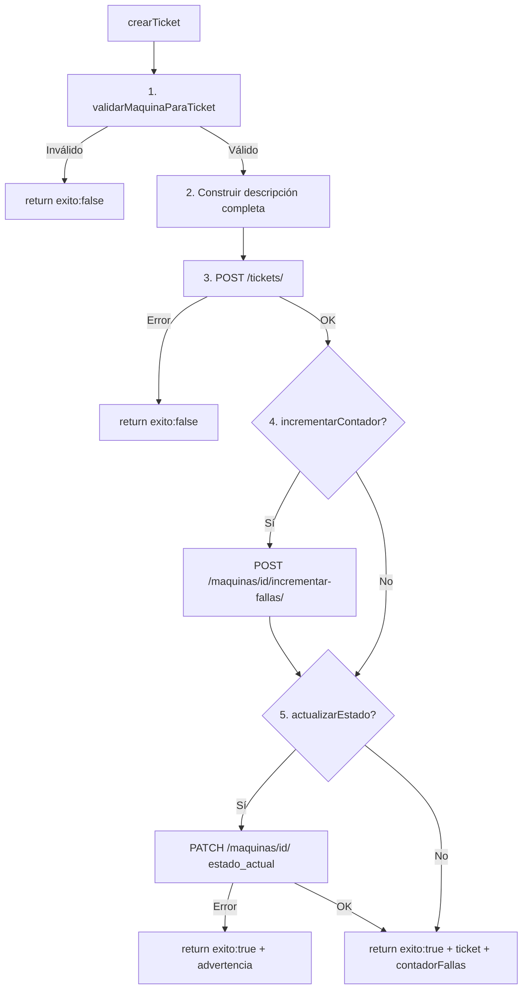

# ticketService.js — Tickets y Bitácora Técnica

**Archivo fuente:** `FrontEnd/src/service/ticketService.js`

Centraliza las operaciones compuestas de tickets para evitar duplicación en múltiples vistas.

---

## `crearTicket(params)` — Función Principal

Orquesta **5 pasos** en secuencia para crear un ticket completo:



### Parámetros

| Param | Tipo | Default | Descripción |
|---|---|---|---|
| `maquinaId` | number | — | ID de la máquina |
| `maquinaUid` | string | — | UID para descripción y mensajes |
| `categoria` | string | — | Categoría del ticket |
| `subcategoria` | string | — | Subcategoría |
| `prioridad` | string | `'media'` | `baja`, `media`, `alta`, `critica` |
| `descripcionBase` | string | — | Texto base del problema |
| `estadoMaquina` | string | `'DAÑADA'` | Estado a asignar a la máquina |
| `reportanteId` | number | — | ID del usuario reportante |
| `notasSeguimiento` | string | `''` | Notas adicionales |
| `incrementarContador` | boolean | `true` | Si incrementa `contador_fallas` |
| `actualizarEstado` | boolean | `true` | Si actualiza `estado_actual` de la máquina |

### Respuesta de éxito

```json
{
  "exito": true,
  "ticket": { "id": 42, "folio": "TKT-0042", ... },
  "contadorFallas": 8
}
```

### Respuesta con advertencia

```json
{
  "exito": true,
  "ticket": { ... },
  "advertencia": "Ticket creado pero no se pudo actualizar el estado de la máquina"
}
```

---

## `validarMaquinaParaTicket(maquinaId, maquinaUid)` *(privada)*

Verifica que la máquina no tenga tickets activos antes de crear uno nuevo.

```javascript
const ticketsAbiertos = tickets.filter(t =>
    t.maquina === parseInt(maquinaId) && t.estado_ciclo !== 'cerrado'
);
```

Si hay tickets abiertos, devuelve:
```json
{
  "valido": false,
  "error": "Ticket ya abierto",
  "detalle": "La máquina \"M042\" ya tiene 1 ticket activo (TKT-0042). Debe cerrarlo antes de crear uno nuevo."
}
```

---

## `crearBitacoraTecnica(params)` — Intervención Técnica

Orquesta el registro de una entrada de bitácora con todas sus actualizaciones colaterales.

### Validaciones previas (antes de llamar al API)

| Regla | Error |
|---|---|
| `finalizaTicket=true` y `resultado !== 'exitosa'` | "El resultado debe ser EXITOSO para cerrar" |
| `finalizaTicket=true` y `estadoMaquinaResultante !== 'operativa'` | "La máquina debe quedar OPERATIVA para cerrar" |

### Pasos de la operación

1. **Crear bitácora** → `POST /bitacora-tecnica/` → captura `puntos_nexus`
2. **Actualizar estado de máquina** → `PATCH /maquinas/{id}/` con estado mapeado
3. Si `finalizaTicket=true`:
   - **Cerrar ticket** → `PATCH /tickets/{id}/` con `estado_ciclo: 'cerrado'`
   - Captura `puntos_nexus` del cierre también
4. **Acumular puntos** de ambas operaciones con `acumularPuntos()`

### Mapeo de estados

```javascript
const estadoMaquinaMapping = {
    'operativa':        'OPERATIVA',
    'dañada_operativa': 'DAÑADA_OPERATIVA',
    'dañada':           'DAÑADA',
    'mantenimiento':    'MANTENIMIENTO'
};
// Si finalizaTicket=true → fuerza estado final a 'OPERATIVA'
```

### Respuesta

```json
{
  "exito": true,
  "bitacora": { ... },
  "puntosNexus": {
    "puntos_otorgados": 50,
    "puntos_totales": 400,
    "mensaje_nexus": "🏅 +50 puntos NEXUS acumulados en esta acción"
  },
  "ticketCerrado": true
}
```

---

## Uso Típico en una Vista

```javascript
import { crearTicket, crearBitacoraTecnica } from '@/service/ticketService'
import { mostrarToastPuntos } from '@/service/gamificacionUtils'

// Crear ticket
const result = await crearTicket({ maquinaId: 5, maquinaUid: 'M042', ... })
if (!result.exito) {
    toast.add({ severity: 'error', summary: result.error, detail: result.detalle })
    return
}

// Registrar bitácora técnica
const bitResult = await crearBitacoraTecnica({ ticketId: result.ticket.id, ... })
if (bitResult.exito) {
    mostrarToastPuntos(toast, bitResult.puntosNexus) // Muestra animación de puntos
}
```
